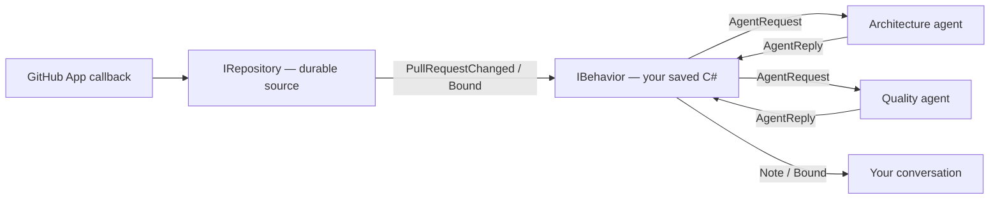

# GitHub PR reviews in DigitalBrain

A repository is a domain event source: `IRepository : IWebhook`. The SDK accepts signed receipts durably and retries recipients independently. A named `IBehavior` owns your C# policy and accepted work. Ordinary named agent neurons perform reviews. There is no active GitHub-specific review worker or mandatory webhook-wrapper neuron.



## Operator setup

Create a GitHub App with repository read permissions for Contents, Pull requests, Checks, Commit statuses and Administration (required-check discovery), plus Metadata. Install it on the intended repositories. The backend exchanges its private key for an installation token scoped to the selected numeric repository and read permissions. The short-lived user OAuth token is used only to establish the intersection of that user's access and the App installation.

The AppHost's `WithConfiguredGitHubRepositories` also reads the shared App configuration:

```json
{
  "DigitalBrain": {
    "Microsoft": {
      "GitHub": {
        "App": {
          "AppId": "12345",
          "Slug": "your-app-slug",
          "ClientId": "your-client-id",
          "PublicOrigin": "https://brain.example.com",
          "PublicWebhookUrl": "https://brain.example.com/integrations/github/webhook"
        }
      }
    }
  }
}
```

Set private AppHost parameters through user secrets or Aspire:

- `Parameters:github-app-private-key`: App PEM private key.
- `Parameters:github-app-webhook-secret`: configured webhook signing secret.
- `Parameters:github-app-client-secret`: App OAuth client secret.

Hosting projects these secrets to the kernel only. They never enter Flutter, scripts or graph metadata.

Register the OAuth callback `<PublicOrigin>/integrations/github/callback`. The local login entry point is `/integrations/github/login`. OAuth uses PKCE, a correlated one-use browser capability and a bounded lifetime. A loopback HTTP PublicOrigin is supported for local OAuth development; webhook ingress still requires an externally reachable HTTPS endpoint.

Configure the App's single webhook URL as `PublicWebhookUrl`, with the same secret. Subscribe to pull-request, check-run, check-suite, status, repository and installation lifecycle events. The shared endpoint routes authenticated observations to the matching authorized sources. Each source durably accepts its own receipt before success is returned; retries after partial acceptance do not duplicate previously accepted work.

Expose only the required routes through your chosen HTTPS ingress. The repository does not create a public tunnel or change your GitHub App configuration. An authenticated ping or event must arrive for the current connection revision before DigitalBrain reports the webhook ready.

## Connect from the conversation

Ask Ino:

> Whenever a new PR opens in https://github.com/intochat/digitalbrain, run my custom C# review. Wait until required CI is green, run architecture and code-quality agents concurrently, and report here.

Ino saves a typed behavior and resolves the repository URL through authorized access. Use its GitHub login card if needed. You are not asked for internal binding IDs, principal prefixes or script placeholders.

A successful callback stores the authorized repository connection. The continuation retains the exact repository URL, behavior name and draft revision. If authenticated ingress is still unverified, the card waits for a signed ping or event within the original ten-minute deadline. It does not rerun a different model-selected target. A changed draft requires a fresh request. Cancellation and expiry retain the draft; they do not silently activate it.

Readiness distinguishes operator configuration, authentication, revoked access, public webhook configuration, verified delivery, CI setup and ready state. Required branch/ruleset checks must be discoverable and nonempty. Unknown, ambiguous, inaccessible or unsupported requirements do not count as green. Correct missing configuration, then retry the original connection request.

## Your script owns review policy

The complete [handler](examples/github-pr-review.csx) has input `PullRequestChanged` and output `Note`. It uses the source that delivered the event:

```csharp
await using IDigitalBrain digitalBrain = await DigitalBrainClient.ConnectAsync(args);
var change = digitalBrain.Input<PullRequestChanged>();
var repository = digitalBrain.Get<IRepository>(digitalBrain.InputSource.Name);
// Read current required checks and exact head/base evidence.
// Ask distinct architecture and quality agents with Task.WhenAll.
// Recheck current head/base and CI, then return one Note.
```

Repository URLs are resolved asynchronously by the connection flow. `Get<IRepository>(url)` is not a synchronous authorization API.

The supplied handler:

- Ignores draft or closed PRs.
- Requires complete evidence and a nonempty strict-success CI set.
- Reviews a verified immutable head/base pair with bounded patch evidence.
- Calls two distinct named agents concurrently.
- Refreshes PR state and required checks before returning its combined note.

Save it with `LatestPerSubject | ObserveFromActivation | OncePerVersion`. These generic input policies retain the initial observation boundary across restart, supersede older observations for the same PR, and publish once per head/base version. A pending-CI input returning null does not prevent the later green observation from executing. Different PRs can run concurrently. Script edits create drafts and future activations; accepted work keeps its own revision.

The repository owns provider observations and consistency. The behavior owns accepted inputs, claims, completed request checkpoints and output. The script owns which agents to call and what to report. A source-bound SDK connection avoids sending concurrent agent calls through the serialized owner root.

## Reliability and operations

The HTTP adapter validates HMAC over exact bytes, payload identity and routing before acceptance. Stable delivery IDs deduplicate retries; a conflicting body returns conflict. Payloads are bounded, and storage failure produces a retryable failure instead of a false success. Agent or recipient latency does not hold the HTTP request open.

Provider processing happens outside source turns. Contiguous redundant refresh receipts can share one observation while preserving every delivery identity. Lifecycle and user facts are not discarded as equivalent refreshes. Reconciliation remains a bounded recovery mechanism for missed provider observations.

Source-owned subscriptions survive restart. Removing one behavior does not remove the shared App connection or another subscriber. Disable removes that behavior's incoming edges and fences old requests/output. Access revocation is durable. Version changes fence old PR attempts. Completed checkpointed requests survive retries; chat publication deduplicates stable note IDs even after transcript retention.

C# runs as trusted code in the scripting process. Arbitrary external side effects need their own idempotency. This implementation does not post GitHub comments, reviews or approvals.

## Removed architecture

The old webhook inbox/dispatcher, fixed review grains, repository MCP adapter,
admission runtime and migration workers are removed. The current repository source
owns receipts and domain facts; the saved C# behavior owns review policy. There is
no automatic execution or conversion of old looping scripts.

## Libraries and verification

Integration code uses stable Octokit for REST transport and available typed APIs, and Octokit.Webhooks for signature validation. Minimal DigitalBrain domain and durable serialization contracts remain where provider types do not express source identity, versioning or replay. Required-check/ruleset gaps still use bounded provider JSON parsing.

Local simulation tests cover signed ingress, conflict/deduplication, partial fanout retries, restart recovery, CI gating, revocation, coalescing and recipient isolation. Live readiness additionally requires the selected App installation and successful delivery through its real public URL. See [recorded validation](programmable-behaviors-validation.md).

Provider references: [user access tokens](https://docs.github.com/en/apps/creating-github-apps/authenticating-with-a-github-app/generating-a-user-access-token-for-a-github-app), [installation APIs](https://docs.github.com/en/rest/apps/installations), [required status-check protection](https://docs.github.com/en/rest/branches/branch-protection#get-status-checks-protection), [webhook validation](https://docs.github.com/en/webhooks/using-webhooks/validating-webhook-deliveries).
