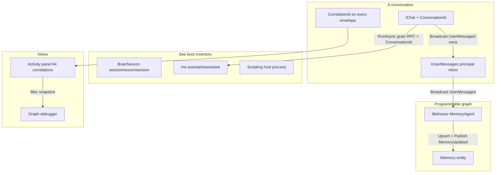
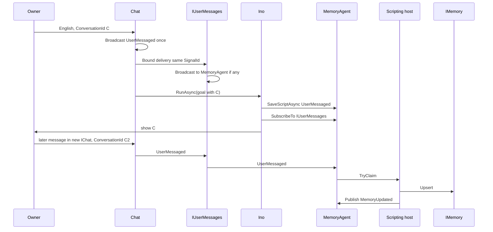

# DigitalBrain Unification: Back to Neuron / Synapse / Signal

| Field | Value |
|---|---|
| **Author** | DigitalBrain unification |
| **Date** | 2026-09-05 |
| **Status** | Draft (revised after design review) |
| **Branch under review** | `codex/day-zero-scripting` (large dirty tree; treat uncommitted work as suspect unless it matches the core model) |
| **Authority** | Owner product intent + `CONTEXT.md` glossary. Code is cited as *current process*, not as something to preserve. |

---

## Overview

DigitalBrain is a personal assistant whose durable graph the owner (or Ino) programs with typed C#. The only sentence that settles naming is: **a neuron fires a signal along a synapse.** Subscribe, unsubscribe, publish, broadcast, and handle are already a complete programming model. Infinite use cases compose from that; extra layers are losing the direction.

This unification plan restores that model as the *only owner-visible* execution and observation path. It keeps the kernel substrate that already implements it (`Neuron`, `SignalSender`, `SignalRouter`, `NeuronSynapses`, `JournalWindow`, `IDigitalBrain`). It deletes `IEmits` and collapses the `IBehaviorKernel` product surface. A small **non-product** host protocol remains so C# can run outside the silo. Grain RPCs that already exist for off-turn LLM (`IChatTurnWorker.RunAsync`, `IAgentKernel.AskStreaming`) are **exempted as hidden implementation**: they are not synapses, never appear on the graph, and must carry `CorrelationId`.

The product that falls out: one Ino at boot; conversations keyed by `CorrelationId`; a first-class activity panel over live / needs-approval / failed / completed correlations; a graph that is a debugger of real synapses and journals; C# scripts compiled against module contracts; Memory as an **entity**; a principal `IUserMessages` inbox so MemoryAgent sees **any** owner message, not one chat.

---

## Background & Motivation

### Why this change is needed

The owner can already ask, in English: *create a MemoryAgent that reacts to any new message I send and saves relevant information in a Memory entity.* That story does not compile or run against the current product surface:

- `IBehavior` is only `IHandle<SaveBehaviorScript, ReadBehavior, EnableBehavior, DisableBehavior, InvokeBehavior>` (`src/Kernel/DigitalBrain.Contracts/Neurons/IBehavior.cs`). It does **not** `IHandle<UserMessaged>`. Generic `SubscribeToAsync<TSelf, TSource, TSignal>` requires `TSelf : IHandle<TSignal>` (`NeuronReferenceExtensions.cs:49–55`). The dirty branch cheats with `BehaviorNeuron.CanHandle` + `HandleUnmatchedAsync` (`BehaviorNeuron.cs:268–281`) and untyped `SubscribeAsync` intersecting `IEmits` (`NeuronReference.cs:39–61`).
- Chat journals `UserMessaged` once (`Chat.RememberOwnerTurnAsync` → `RecordOutgoingAsync`, `Chat.cs:871–875`) for Flutter SSE (`MapChatStreams.ProjectTurn`). It does not deliver to subscribers.
- `SignalSender.BroadcastAsync` (`SignalSender.cs:88–97`) **records nothing when there are zero synapses** and **records N outgoing envelopes for N recipients**. Rollout “zero synapses ⇒ Broadcast returns 0” would starve SSE. Copying `XAccountNeuron` (`RecordOutgoingAsync` then `BroadcastAsync`, `XAccountNeuron.cs:13–15`) would double-write.
- Client `PublishAsync` is `=> SendAsync` (`NeuronReferenceExtensions.cs:41–47`). Owner English treats publish as fan-out.
- The chat turn **leaves the signal model**: `Chat.RunTurnAsync` → `IChatTurnWorker.RunAsync(ChatTurnGoal)` (`Chat.cs:656–671`, `IChatTurnWorker.cs`); worker → `IAgentKernel.AskStreaming` (`ChatTurnWorker.cs:220–226`). `Agent.AskStreaming` journals `AgentActivity` with `_handling == null`, so **each** started/completed activity mints a **new** `CorrelationId` (`Agent.cs:76–77, 144–146`).
- Saved behaviors grew a parallel kernel: `BehaviorNeuron` (~1100 lines), `IBehaviorKernel` (**10** methods in `IBehaviorKernel.cs`), `BehaviorsNeuron` wake index, `BehaviorExecutionWorker`, `BehaviorInputPolicy` / `IVersionedSignal`, Ino JSON tools (`Assistant.Behaviors.cs`). Execution `SendAsync` uses `PrepareRequest` then `Deliver`, not `SignalSender` (`DigitalBrainClientTransport.Execution.cs:32–45`).

CONTEXT.md still says the right words. The dirty branch implemented a second product on top of them.

### Current state (what is actually true in code)

**Kernel loop is correct in the small.** `SignalSender.SendAsync` records an outgoing `SignalDelivery`, delivers to one receiver, and on `DeliveryOutcome.Handled` reinforces a **Learned** synapse. `BroadcastAsync` asks `SignalRouter.BroadcastRecipientsFor` — **only this source's synapses of that signal type**. `Subscribe` / `Unsubscribe` `BindOutgoing` / `UnbindOutgoing` a **Bound** edge on the source. Journals are 512 entries / 512 KB per direction (`JournalWindow`). Entities have no journals.

**Boot** is not “BrainNeuron + Ino.” See [Boot inventory](#boot-inventory). `IDigitalBrain.ActivateAsync` hits `BrainNeuron.Activate` (`sessionneuron`/`session`). First activation records `DigitalBrainActivated` and also publishes it on an Orleans `BroadcastChannel` (`BrainNeuron.cs:36–43`) — a second bus. Ino is grain type `assistant`, instance `"assistant"`, resolved by the **private method** `ChatTurnWorker.DefaultResponder` (`ChatTurnWorker.cs:231–233`), not a public field.

**Chat turn today (correlation broken).**

```mermaid
sequenceDiagram
    participant Flutter
    participant SSE as MapChatStreams
    participant Chat as IChat
    participant Worker as IChatTurnWorker
    participant Exec as ExecutionNeuron
    participant Ino as IAgentKernel
    participant Spec as IGmail / ISalesforce / IAspire

    Flutter->>SSE: POST message
    SSE->>Chat: RequestAsync(SendMessage)
    Chat->>Chat: RecordOutgoing(UserMessaged)
    Note over Chat: one journal write; BroadcastAsync not called
    Chat->>Chat: RecordOutgoing(TurnLifecycle Pending)
    Chat->>Worker: RunAsync(ChatTurnGoal) grain RPC
    Worker->>Exec: StartExecution
    Worker->>Ino: AskStreaming(messages) grain RPC
    Ino-->>Ino: RecordOutgoing(AgentActivity) new CorrelationId
    Ino->>Spec: RequestAsync(AgentRequest)
    Spec-->>Ino: AgentReply
    Ino-->>Worker: text / UserActionRequest
    Worker-->>Chat: ChatTurnResult
    Chat->>Chat: RecordOutgoing(Responded)
    SSE-->>Flutter: UserMessaged / Responded / TurnLifecycle
```

**Graph today.** `BrainGraphProjection` rebuilds HTTP from `ReadSynapses` + journals. Seeds: current chat, `chat-turn-worker`, `assistant`, owner root, `IBehaviors`, active `IExecution`. Activity is last **64 deliveries** (`MaxActivity = 64`, then `Take(MaxActivity)`), not 64 correlations. Flutter `BrainGraphStore`: journals are observations, never work queues. `studioCanvas` hides `isInfrastructure`.

**Scripting today.** `IDigitalBrain.Input<T>()` throws unless `BindExecution` is in effect. `BehaviorProgramRunner` wraps source as `Script<Signal?>`. `Complete(claim, Signal?)` fills an outbox and flushes via `BroadcastRecipients` — a second broadcast.

`IEmits` implementers are only `IWebhook`, `IXAccount`, `IRepository` (verified). `CONTEXT.md` Entity line still says “Chart, Surface” without Memory.

### Pain points

| Pain | Evidence | Why it violates the model |
|---|---|---|
| Two capability systems | `IHandle<T>` and `IEmits<T>` | Emission is not a capability layer. |
| Behaviors cannot `IHandle` script inputs | `IBehavior` management handles only | Generic `SubscribeToAsync` will not compile for `UserMessaged`. |
| Broadcast records 0 or N envelopes | `SignalSender.BroadcastAsync` | SSE needs exactly one `UserMessaged`. |
| Two broadcast implementations | `SignalSender` vs behavior outbox | Different durability. |
| Chat turn is grain RPC | `RunAsync`, `AskStreaming` | Correlation does not chain. |
| `PublishAsync` = `SendAsync` | `NeuronReferenceExtensions` | Owner “publish” means fan-out. |
| Activity is a transcript | `ActivityScreen` lists `ChatTurnEvent` | Not grouped by correlation. |
| Memory is a neuron | `VectorMemoryNeuron` | Memory snapshot is an entity. |

**Dirty branch — keep:** GitHub review orchestrator removed; SDK owns `DigitalBrainClient` and `WebhookNeuron`; graph does not invent synapses for `AgentActivity`; `SignalRouter` matches the glossary; `UserMessaged` typed fact exists.

**Dirty branch — do not keep:** `IEmits`; behavior kernel as owner API; return-as-publish; `Input<T>()` on `IDigitalBrain`; untyped subscribe; XAccount double-write as a pattern.

---

## Goals & Non-Goals

### Goals

1. **One owner-visible model.** Neuron, Signal, Synapse, Journal, Entity, `IDigitalBrain`. No `IEmits`. Hidden grain RPCs (chat-turn offload, LLM stream) are listed and exempted; they still thread `CorrelationId`.
2. **Smallest complete API:** `Get` / `GetEntity` / `Send` / `Request` / `SubscribeTo` / `UnsubscribeFrom` / `Publish` / `Broadcast` / `Handle`. `Publish` **is** broadcast (one journal write + fan-out along synapses). `Send`/`Request` are directed. No third name for Send.
3. **Behaviors subscribe without pretending `IHandle<T>`.** `NeuronReference<IBehavior>.SubscribeToAsync<TSource, TSignal>` has **no** `IHandle` constraint. Accept-list is the **active** program’s `InputSignalTypes` at runtime.
4. **One Ino at boot.** New topic = new `IChat` + `CorrelationId`, never a second assistant. **Any-message** subscribers bind to `IUserMessages`, not a single chat.
5. **Activities** are views over `CorrelationId`. Status precedence is defined. Cap is 64 **correlations**.
6. **C# scripts** against module contracts, out of silo. Host protocol is internal, specified, split across PRs.
7. **MemoryAgent** works: entity + inbox + broadcast + behavior subscribe API.
8. **Graph UI is a debugger.**
9. **See everything currently happening** from journals + correlation, not a new store.

### Non-goals

- Implementing this plan or treating tests as the *goal* (CI still requires test updates **in the same PR** — see PR Plan).
- Runtime-generated Orleans types (Alternative B stays rejected).
- `IBehavior : IHandle<UserMessaged>` on the contract.
- An Activity grain / durable-runs event store.
- Replacing Gmail/Salesforce/Aspire/MCP/OAuth policy.
- Making `AskStreaming` / `RunAsync` into signals in this unification (exempted; correlation plumbed instead).
- Infinite journal retention.

---

## Canonical glossary

**Neuron** — Durable actor. Receives and emits typed Signals, owns Synapses and journals. Avoid: agent, service, grain (product language). `IAgent` may remain a module contract.

**Signal** — Typed immutable message. Identity, causation, correlation, ownership ride `SignalDelivery`.

**Synapse** — Directed, typed, weighted edge on the **source**. `SubscribeTo` → Bound. Handled `Send` → Learned. Anatomy, not traffic.

**Journal** — Bounded window over incoming/outgoing `SignalDelivery`s. Not an event store, not a record of synapses.

**Entity** — Live snapshot: Chart, Surface, **Memory**. `GetEntity`. No journal, no synapses, not a send target.

**IDigitalBrain** — Owner handle. Not Orleans.

**Conversation** — Topic with Ino. Identity: `CorrelationId` stored on that `IChat`. UX container: `IChat` instance. Not a second Ino.

**Activity** — View of one `CorrelationId`. Not a grain.

**IUserMessages** — Principal-scoped inbox neuron. Every `IChat` binds `UserMessaged` to it on first activation. Global subscribers (MemoryAgent) bind to the inbox, not to one chat.

**Script / Behavior** — Saved C# on a named `IBehavior` neuron. `IBehavior` **management** handles stay on the contract. Script input types are a **runtime accept-list**, not `IHandle<T>` on `IBehavior`.

**Publish / Broadcast** — The same fan-out: one owner-visible outgoing journal write, then deliver that envelope along synapses of T. Empty audience still journals once (SSE). Directed traffic is `Send` / `Request` only.

**Trigger** — `Send`/`Request` of `TSignal` only compile when the **target** `IHandle<TSignal>`s it. A behavior is not such a target for script inputs; its subscribe API is specialized.

---

## Proposed Design

### 1. Smallest complete API

Keep `SendAsync` / `RequestAsync` / `SubscribeToAsync` on ordinary `NeuronReference<TNeuron>` **including** `where TNeuron : IHandle<TSignal>` for non-behavior neurons.

**Add behavior-only subscribe (no `IHandle` constraint):**

```csharp
public static class BehaviorReferenceExtensions
{
    // IBehavior is NOT IHandle<TSignal>. This method must not use
    // NeuronReferenceExtensions.SubscribeToAsync<TSelf, TSource, TSignal>.
    public static Task SubscribeToAsync<TSource, TSignal>(
        this NeuronReference<IBehavior> subscriber,
        NeuronId source,
        CancellationToken cancellationToken = default)
        where TSource : INeuron
        where TSignal : Signal
    {
        var expected = NeuronId.For<TSource>(source.Owner, source.Name);
        if (source != expected)
            throw new ArgumentException($"Neuron '{source}' is not a '{expected.Type}' instance.", nameof(source));
        // INeuron : IHandle<Subscribe> — this compiles.
        return subscriber.SendAsync(new Subscribe(source, typeof(TSignal).Name), cancellationToken);
    }

    public static Task UnsubscribeFromAsync<TSource, TSignal>(
        this NeuronReference<IBehavior> subscriber,
        NeuronId source,
        CancellationToken cancellationToken = default)
        where TSource : INeuron
        where TSignal : Signal
        => subscriber.SendAsync(new Unsubscribe(source, typeof(TSignal).Name), cancellationToken);

    // Replace SaveScriptAsync<TInput, TOutput> as the MemoryAgent path.
    // Output types are not declared: the handler Publish/Broadcasts explicitly.
    // Same shape as existing SaveScriptAsync<TInput, TOutput>: Request then AwaitValidation.
    public static async Task<BehaviorView> SaveScriptAsync<TInput>(
        this NeuronReference<IBehavior> behavior,
        string source,
        CancellationToken cancellationToken = default)
        where TInput : Signal
    {
        var saved = (await behavior.RequestAsync(
            new SaveBehaviorScript(source, [typeof(TInput).Name]),
            cancellationToken).ConfigureAwait(false)).Behavior;
        return await AwaitValidation(behavior, saved, cancellationToken).ConfigureAwait(false);
    }
}
```

**`IBehavior` stays management handles only.** Do not write “static `IHandle` after compile.” That would require runtime-generated Orleans types (forbidden).

**Split two predicates — do not overload `CanHandle` for both subscribe and traffic:**

| Predicate | When | True iff |
|---|---|---|
| **Subscribe permission** (`CanHandle` override + `ValidateSubscriptionAsync`) | `Subscribe` / `Unsubscribe` → `BindFromAsync` → `RequireSubscription` | CLR `IHandle<>` (management signals) **∪** valid `Draft.InputSignalTypes` **∪** `Active.InputSignalTypes`. Draft must be `BehaviorValidation.Valid` (same as today `ValidateSubscriptionAsync`, `BehaviorNeuron.cs:292–294`). |
| **Accept** (`HandleUnmatchedAsync` only) | Incoming script input (`UserMessaged`, …) | `state.Enabled && state.Active?.InputSignalTypes.Contains(signalType)`. **Draft types do not accept traffic.** |

Keep the published composition order **Save → Subscribe → Activate**. Subscribe succeeds against the valid draft; Activate promotes draft → Active and then Accept starts. Activate still refuses if a Bound subscription’s type is missing from the new Active list (`IncompatibleSubscription` today). `HandleUnmatchedAsync` calls `Accept` only when the Accept predicate matches; otherwise `Unhandled`.

**Publish = Broadcast (delete the Send alias):**

```csharp
public interface IDigitalBrain : IAsyncDisposable
{
    OwnerId Owner { get; }
    Task ActivateAsync(CancellationToken cancellationToken = default);
    NeuronReference<TNeuron> Get<TNeuron>(string name = "default") where TNeuron : INeuron;
    TEntity GetEntity<TEntity>(string name = "default") where TEntity : class, IEntity;
    Task<JournalRead> ReadJournalAsync(JournalKind kind, long afterSequence = 0, CancellationToken cancellationToken = default);
    IAsyncEnumerable<JournalRead> WatchJournalAsync(JournalKind kind, long afterSequence = 0, CancellationToken cancellationToken = default);
    Task<IReadOnlyList<Synapse>> GetSynapsesAsync(CancellationToken cancellationToken = default);

    /// <summary>
    /// One outgoing journal write on the executing neuron, then deliver along
    /// that neuron's synapses of T. Empty audience still records once.
    /// Throws if this client is not a behavior execution connection.
    /// </summary>
    Task<int> PublishAsync<TSignal>(TSignal signal, CancellationToken cancellationToken = default)
        where TSignal : Signal;

    Task<int> BroadcastAsync<TSignal>(TSignal signal, CancellationToken cancellationToken = default)
        where TSignal : Signal
        => PublishAsync(signal, cancellationToken);
}
```

Remove `IDigitalBrain.Input<T>()` and `InputSource` from the interface. Handlers read `Signal` / `CancellationToken` from `StartupScriptContext` (Roslyn globals), not from `IDigitalBrain`.

Remove `NeuronReferenceExtensions.PublishAsync` that forwards to `SendAsync`.

**Transport (execution only):**

```csharp
// DigitalBrainClientTransport — execution connection only
internal async Task<int> PublishAsync(Signal signal, CancellationToken cancellationToken)
{
    if (_executionSource is null)
        throw new InvalidOperationException("Publish/Broadcast is available only while a saved behavior is executing.");
    using var actor = EnterConnectionActor();
    return await _grains.GetGrain<INeuronGrain>(_executionSource.Value.ToGrainId())
        .Broadcast(signal, cancellationToken)
        .WaitAsync(cancellationToken);
}
```

```csharp
// INeuronGrain — add. No CorrelationId on the wire: the neuron applies cause.
[Alias(nameof(Broadcast))]
[ResponseTimeout(NeuronCallTimeouts.LongRunning)]
Task<int> Broadcast(Signal signal, CancellationToken cancellationToken = default);
```

**`BehaviorNeuron.Broadcast` (mandatory, PR-4):** this call is **not** a `HandleAsync` turn (`_handling` is null). Use the **current claimed work’s `Input`** (`BehaviorClaim.Input` / `BehaviorWork.Input`) as `cause` so `MemoryUpdated` inherits the accepted `UserMessaged` correlation. If no live claim, throw. Then `_sender.BroadcastAsync(signal, cause: work.Input, correlation: work.Input.CorrelationId)`.

In-silo neurons implement `INeuronGrain.Broadcast` as `_sender.BroadcastAsync(signal, _handling)` (cause = current delivery). Non-execution clients cannot call this through `IDigitalBrain`.

### 2. Broadcast records once, then fans out

Change `SignalSender.BroadcastAsync` (`SignalSender.cs:88–123`). Do **not** copy XAccount.

**Semantics**

| Audience | Outgoing journal on source | Deliveries |
|---|---|---|
| 0 synapses | **One** `RecordOutgoingAsync` | 0 |
| N synapses | **One** `RecordOutgoingAsync` | N `DeliverAsync` of **that same** `SignalDelivery` (same `SignalId` / `CorrelationId`) |

```csharp
internal async Task<int> BroadcastAsync(
    Signal signal,
    SignalDelivery? cause,
    CorrelationId? correlation = null)
{
    ArgumentNullException.ThrowIfNull(signal);
    var id = correlation ?? cause?.CorrelationId ?? CorrelationId.New();
    var delivery = await RecordOutgoingAsync(signal, cause, id); // always once
    var receivers = _router.BroadcastRecipientsFor(signal, _source, _synapses).Distinct().ToArray();
    List<Exception>? failures = null;
    foreach (var receiver in receivers)
    {
        try
        {
            var outcome = await DeliverAsync(receiver, delivery, DeliveryMode.Awaited, CancellationToken.None);
            if (outcome == DeliveryOutcome.Handled)
                _synapses.Reinforce(receiver, signal.GetType().Name, SynapseKind.Learned);
        }
        catch (Exception error) when (error is not OperationCanceledException)
        {
            (failures ??= []).Add(error);
        }
    }
    if (failures is not null)
        throw new AggregateException("One or more signal subscribers failed to handle the broadcast.", failures);
    await _persist(CancellationToken.None);
    return receivers.Length;
}
```

Do not call `SendAsync` per recipient (that re-records). `XAccountNeuron` drops the extra `RecordOutgoingAsync` and only `BroadcastAsync(new NewPost(...))` (NewPost may mint a new correlation; it is not a conversation).

**`Neuron` overloads (mandatory):**

```csharp
protected Task<int> BroadcastAsync(Signal signal)
    => _sender.BroadcastAsync(signal, _handling, correlation: null);

protected Task<int> BroadcastAsync(Signal signal, CorrelationId correlation)
    => _sender.BroadcastAsync(signal, _handling, correlation);

protected Task<SignalDeliveryResult> SendAsync(
    NeuronId receiver, Signal signal, CancellationToken cancellationToken = default)
    => _sender.SendAsync(receiver, signal, _handling, correlation: null, cancellationToken);

protected Task<SignalDeliveryResult> SendAsync(
    NeuronId receiver, Signal signal, CorrelationId correlation,
    CancellationToken cancellationToken = default)
    => _sender.SendAsync(receiver, signal, _handling, correlation, cancellationToken);

protected Task<SignalDelivery> RecordOutgoingAsync(Signal signal, CorrelationId correlation)
    => _sender.RecordOutgoingAsync(signal, _handling, correlation);
```

Expose the existing private `SignalSender.SendAsync(..., CorrelationId? correlation, ...)` (`SignalSender.cs:54–58`) to those overloads. Public client `Send` still passes `correlation: null` (inherits cause).

`Chat.RememberOwnerTurnAsync` becomes **`BroadcastAsync(new UserMessaged(...), ConversationId)` only** — not Record then Broadcast, and **not** `BroadcastAsync(signal)` which would use `_handling` (the per-POST `SendMessage` envelope, a new id). SSE still sees one outgoing `UserMessaged` stamped with the stable conversation id. Inbox `HandleAsync(UserMessaged)` calls `BroadcastAsync(signal)` with `_handling` as cause so the inbox fan-out **inherits** Chat’s `ConversationId`.

Chat already has `protected BroadcastAsync`. The Chat path does **not** need `IDigitalBrain.BroadcastAsync`. The `ConversationId` argument on Chat’s call is **PR-2** (field exists); the `BroadcastAsync(signal, CorrelationId)` overload is **PR-1**.

### 3. Conversation correlation — plumb the id (do not convert the turn to a signal in this unification)

**Decision (b):** keep `IChatTurnWorker.RunAsync` and `IAgentKernel.AskStreaming` as grain RPCs. They are not synapses, never on the graph, and **must** take `CorrelationId`. Decision (a) (typed turn signal into Ino `HandleAsync`) is rejected for this series: the worker exists so Chat’s serialized turn stays free; putting the LLM stream on Ino’s `HandleAsync` would block Ino for the whole model call. Alternative A-signal is recorded under Alternatives.

**IChat state:** durable `CorrelationId ConversationId` allocated once in `OnNeuronActivatedAsync` if unset (`CorrelationId.New()`). Chat’s `SendMessage` `_handling` is a **per-POST** id (client `Send` passes `correlation: null`). Every conversation-scoped journal write must pass **`ConversationId` explicitly**, not inherit `_handling`.

**Mandatory overloads and call sites (not “if needed”):**

```csharp
// ChatTurnGoal — add Id(9)
[property: Id(9)] CorrelationId ConversationId

// IAgentKernel — both methods take the id
Task<AgentReply> Ask(AgentRequest request, CorrelationId conversationId, CancellationToken cancellationToken = default);
IAsyncEnumerable<ChatResponseUpdate> AskStreaming(
    IReadOnlyList<ChatMessage> messages,
    CorrelationId conversationId,
    CancellationToken cancellationToken = default);

// Agent.AskStreaming — store the id on the in-flight turn
using var requests = new TurnRequests(this, conversationId, cancellationToken);
using var context = new AgentToolContext(..., async observation =>
    await RecordOutgoingAsync(observation, conversationId));
await RecordOutgoingAsync(new AgentActivity(...), conversationId);

// TurnRequests (Agent.Delegation.cs) — constructor stores conversationId
public async Task<DeliveryOutcome> SendAsync(NeuronId target, Signal signal, CancellationToken cancellationToken = default)
    => (await source.SendAsync(target, signal, conversationId, deadline.Token)).Outcome;
// RequestAsync likewise: source.SendAsync(..., conversationId) then wait on the reply journal
// (Neuron.RequestAsync must thread correlation into SendAsync; add the same CorrelationId arg)

// Agent.Ask / AskDurablyAsync (Agent.cs, Agent.Requests.cs)
public Task<AgentReply> Ask(AgentRequest request, CancellationToken cancellationToken = default)
    => Ask(request, CurrentDelivery?.CorrelationId ?? CorrelationId.New(), cancellationToken);

public async Task<AgentReply> Ask(AgentRequest request, CorrelationId conversationId, ...)
{
    await foreach (var chunk in AskStreaming([new ChatMessage(ChatRole.User, request.Text)], conversationId, ...))
        ...
}

AskDurablyAsync: var id = CurrentDelivery?.CorrelationId ?? CorrelationId.New();
                 return await Ask(request, id, cancellationToken);
```

`Chat.RunTurnAsync` copies `ConversationId` onto `ChatTurnGoal`. `ChatTurnWorker.RunResponderAsync` passes `goal.ConversationId` into `AskStreaming`. `RememberOwnerTurnAsync` / `TurnLifecycle` / `Responded` use `BroadcastAsync`/`RecordOutgoingAsync(..., ConversationId)`.

`AgentActivity` is evidence **inside** that correlation, not a second activity id. `ChatTurnEvent.CorrelationId` and `BrainGraphActivity.CorrelationId` become the same conversation id for one topic.

### 4. Target architecture



### 5. Chat fires `UserMessaged` (in-silo)

After accept, `RememberOwnerTurnAsync` calls `BroadcastAsync(new UserMessaged(...), ConversationId)` (§2 overloads). One journal write keeps SSE. Fan-out delivers to Bound targets, including `IUserMessages` (§6), all with that conversation id.

`Responded` / `TurnLifecycle` stay journaled, not broadcast.

### 6. `IUserMessages` — any owner message

Owner story is **any** new message, not one `IChat`.

**Home:** UI module next to `IChat` / `UserMessaged` (`src/Modules/UI/DigitalBrain.Modules.UI.Contracts/Chat/` + `src/Modules/UI/DigitalBrain.Modules.UI/Chat/`). Kernel must not take a Chat-contract dependency.

**Contract + implementation**

```csharp
namespace DigitalBrain.Chat;

[Alias("db.user-messages")]
public interface IUserMessages : INeuron, IHandle<UserMessaged>;

[GrainType("usermessages")] // NeuronId.For lowercases to "usermessages"
internal sealed class UserMessagesNeuron(NeuronRuntime runtime) : Neuron(runtime), IUserMessages
{
    public Task HandleAsync(UserMessaged signal, CancellationToken cancellationToken)
        => BroadcastAsync(signal); // cause = _handling → inherit Chat ConversationId
}
```

**Wiring (kernel policy on Chat, not Ino re-subscribe).** `Chat.OnNeuronActivatedAsync` does **not** set `VerifiedActor` (`Chat.cs:76–81`). Parse the principal from the already-scoped instance name:

```csharp
protected override async Task OnNeuronActivatedAsync(CancellationToken cancellationToken)
{
    // existing FailUnavailableUserActions / FailTurnInterruptedByRestart ...
    if (!PrincipalPartition.TryParse(Id.Name, out var principal, out _))
        throw new NeuronAuthorizationException($"Chat '{Id}' is not principal-scoped.");
    var inbox = NeuronId.For<IUserMessages>(Id.Owner, PrincipalPartition.InstanceName(principal, "default"));
    await BindOutgoing(inbox, nameof(UserMessaged));
}
```

Each conversation Chat then has Bound edge Chat --UserMessaged--> inbox. Inbox `HandleAsync` `BroadcastAsync(signal)` inherits `_handling.CorrelationId` (Chat’s `ConversationId`).

MemoryAgent composition subscribes to the **inbox**, once:

```csharp
await using IDigitalBrain brain = await DigitalBrainClient.ConnectAsync(args);
var inbox = brain.Get<IUserMessages>("default");
var memoryAgent = brain.Get<IBehavior>("MemoryAgent");
await memoryAgent.SaveScriptAsync<UserMessaged>(handlerSource);
await memoryAgent.SubscribeToAsync<IUserMessages, UserMessaged>(inbox.Id);
await memoryAgent.ActivateAsync();
```

New conversations inherit the Chat→inbox Bound edge. Ino does not re-subscribe per topic.

Conversation-local subscribers still `SubscribeTo` a specific `IChat`.

### 7. Scripting host protocol (internal, specified)

Owner API: `SaveBehaviorScript`, `EnableBehavior`, `DisableBehavior`, `InvokeBehavior`, `ReadBehavior`, `Subscribe`/`Unsubscribe`. No `Input<T>()` on `IDigitalBrain`. No `return Signal` publish.

**Remaining non-product grain interface** (rename from `IBehaviorKernel` when the owner surface is gone; methods):

| Method | Keep? | Role |
|---|---|---|
| `ReadState` | yes | Host + Studio |
| `ValidateDraft` | yes | Compile diagnostics |
| `TryClaim` | yes | Host takes next work |
| `Renew` | yes | Lease while running |
| `Complete(workId)` | yes | **No `Signal? output`** |
| `Fail(workId, detail, retryable)` | yes | |
| `PrepareRequest` / `CompleteRequest` / `ReadCheckpoint` / `StoreCheckpoint` | **delete in PR-D** | Replaced by `SignalSender` |
| `Complete(claim, Signal?)` outbox flush | **delete in PR-D** | Handler calls `PublishAsync` |

**Work item (persist on `BehaviorNeuron`):** `Guid WorkId`, `SignalDelivery Input` (includes `CorrelationId`), `Guid Revision`, lease token, attempts. Capacity **256** (keep `PendingCapacity`). Poison: after 3 fail-closed attempts, `Fail(..., retryable: false)`, leave in journal as outgoing `BehaviorWorkFailed` (new ordinary `Signal` for the activity view). Do not silently drop.

**Accept → run**

1. Incoming `UserMessaged` (or other listed type) hits `HandleUnmatchedAsync` → persist work → `RecordOutgoingAsync(new BehaviorWorkAvailable(Id))` on **this** behavior (not only the index).
2. Host watches the behavior’s **outgoing** journal for `BehaviorWorkAvailable` **and** recovers by `IBehaviorsKernel.ReadBehaviorIds()` (durable name set; **hidden**, not a boot canvas citizen). Orleans will not enumerate `behavior` grains; the index stays for discovery after process restart.
3. `TryClaim` → `DigitalBrainClient.ConnectExecution(grains, behaviorId, claim)`.
4. Runner invokes the generated wrapper (below). Handler `SendAsync`/`PublishAsync` go through `INeuronGrain.Deliver` / `INeuronGrain.Broadcast` → `SignalSender`, not `PrepareRequest`.
5. `Complete(workId)` with no output signal.

**Handler entrypoint (`BehaviorProgramRunner`)**

Stop `Script<Signal?>` as the product result. Generated wrapper:

```csharp
async Task __DigitalBrainBehavior_{revision:N}()
{
#line 1 "behavior.csx"
    // owner source
#line default
}
await __DigitalBrainBehavior_{revision:N}();
```

Globals remain `StartupScriptContext`: `Brain`, `Signal`, `CancellationToken`, `args`. Remove `IDigitalBrain.Input<T>()`. Deadline: 2 minutes (keep). CancellationToken is the lease-linked token.

**Exact MemoryAgent handler Ino must emit** (compilable against module contracts):

```csharp
await using IDigitalBrain brain = await DigitalBrainClient.ConnectAsync(args);
if (Signal is not UserMessaged message)
    return;
if (string.IsNullOrWhiteSpace(message.Text) || message.Text.Length < 24)
    return;
var memory = brain.GetEntity<IMemory>("default");
var key = message.CommandId.ToString();
await memory.Upsert(new MemoryFact(
    key,
    message.Text,
    message.Chat.ToString(),
    DateTimeOffset.UtcNow,
    message.CommandId.ToString()));
await brain.PublishAsync(new MemoryUpdated(key, message.Chat));
```

Relevance in v1 is **length ≥ 24** (no LLM in the handler unless the owner’s C# `RequestAsync`s `IAssistant`). Ino may generate a stricter `if` the owner asked for “relevant.”

**Split:** PR-D rewrites the worker onto `SignalSender` while `TryClaim` remains. PR-E deletes `IEmits` **together with** `BehaviorReferenceExtensions.SubscribeToAsync`. PR-F deletes `Input<T>`, return-as-publish, `BehaviorInputPolicy`, outbox, `IVersionedSignal` from the kernel. Do not one-shot ~1100 lines.

### 8. Graph debugger

Unchanged intent. Projection from synapses + journals. Inspector subscribe uses `Subscribe`/`Unsubscribe`. Studio is an editor of the same neurons, not a runtime.

Default home: activity graph + composer (Lumen brief). Transcript is a drawer.

### 9. Confirmation, failure, activity HTTP

No approval engine. Reuse `UserActionRequest`.

**Status precedence** (first match wins):

1. **failed** — any envelope in the correlation with `TurnLifecycle.Status == Failed`, or `AgentActivity.IsError`, or `BehaviorWorkFailed`.
2. **needs-approval** — unconsumed, unexpired `UserActionRequest` on `Responded` / turn.
3. **live** — `TurnLifecycle` non-terminal, or `AgentActivity` `started` without a later `completed`/`failed`/`cancelled` for the same `OperationId`.
4. **completed** — otherwise.

**DTOs** (`BrainGraphModels.cs` + HTTP):

```csharp
internal sealed record BrainActivitySnapshot(
    string ChatId,
    DateTimeOffset ObservedAt,
    bool Truncated,
    IReadOnlyList<BrainActivity> Activities);

internal sealed record BrainActivity(
    string CorrelationId,
    string Status, // failed | needs-approval | live | completed
    DateTimeOffset StartedAt,
    DateTimeOffset UpdatedAt,
    IReadOnlyList<string> NeuronIds,
    string Summary,
    UserActionRequest? PendingAction);
```

- `GET /chats/{chatName}/activities` — snapshot.
- `GET /chats/{chatName}/activities/events` — SSE of `BrainActivitySnapshot` (same watch loop as `BrainGraphStream`, different projection).
- Flutter `ActivityScreen` consumes this store, **not** `ChatTurnEvent` from chat SSE.

**Caps:** activity **list** keeps at most **64 correlations** (not 64 deliveries). Group first, then `OrderByDescending(UpdatedAt).Take(64)`. Set `Truncated` if more correlations exist in the joined windows or any window has `ResetSnapshot`. Drill-in = existing `BrainGraphSnapshot` **filtered** by `CorrelationId` (nodes/edges/activity whose envelopes match). That is **not** a complete DAG; compacted journal prefixes can omit the start of a live correlation. UI must show `Truncated`.

**`MemoryUpdated` is required** for the MemoryAgent pulse. Entity writes are unjournaled. Without this signal the graph will not show the write. `IBehavior` Publish of `MemoryUpdated` uses the executing neuron as source; Chat may `IHandle<MemoryUpdated>` only if we want it in the transcript — **do not**. Activity sees it on MemoryAgent’s outgoing journal.

```csharp
[GenerateSerializer, Alias("memory.updated")]
public sealed record MemoryUpdated(
    [property: Id(0)] string Key,
    [property: Id(1)] NeuronId SourceChat) : Signal;
```

### 10. Memory entity

Follow `IChart`: `IEntity<TState>` + grain commands.

```csharp
namespace DigitalBrain.Memory;

[Alias("memory.snapshot")]
public interface IMemory : IEntity<MemoryState>
{
    [Alias(nameof(Upsert))]
    Task Upsert(MemoryFact fact);

    [Alias(nameof(Remove))]
    Task Remove(string key);
}

[GenerateSerializer, Alias("memory.state")]
public sealed record MemoryState(
    [property: Id(0)] IReadOnlyList<MemoryFact> Facts);

[GenerateSerializer, Alias("memory.fact")]
public sealed record MemoryFact(
    [property: Id(0)] string Key,
    [property: Id(1)] string Text,
    [property: Id(2)] string SourceChat,
    [property: Id(3)] DateTimeOffset RecordedAt,
    [property: Id(4)] string CommandId);
```

- Grain type from `GrainTypeNames.Of(typeof(IMemory))`. Id: `EntityId.For<IMemory>(owner, PrincipalPartition.InstanceName(principal, "default"))` — same partition as other entities (`DigitalBrainClientTransport.GetEntity`).
- Bound: **4096** facts, oldest dropped on Upsert when over cap (replaces mythical `IFactMemory` in `docs/JOURNALS.md`).
- `Text` max 8_192 chars; refuse longer.
- Upsert by `Key` is last-write-wins.
- **No conflict with `IVectorMemory`:** that remains a search **neuron** (`StoreVectorMemory` / `SearchVectorMemory`). MemoryAgent does not call it unless the owner’s C# does.

### 11. Ino prompt delta (replace the behavior paragraphs in `Assistant.cs`)

Replace lines that teach `Input<T>()`, `return Note`, `SubscribeAsync(source)`, and the JSON catalog with:

```
Saved behaviors are named IBehavior neurons. They do not IHandle script inputs;
SubscribeToAsync<TSource, TSignal> on NeuronReference<IBehavior> is the only subscribe.
Save C# with SaveScriptAsync<TInput>(source). The handler sees Signal and Brain
globals; it must not call IDigitalBrain.Input. To emit, call await brain.PublishAsync(...)
or Get<T>().SendAsync — never return a Signal as publication.
For “any message I send”, subscribe to IUserMessages, not IChat.
Show the owner the C# before ActivateAsync. If compile diagnostics exist, read them
and amend the source; do not activate.
Do not claim a Memory entity write is on the graph unless the handler PublishAsync
a MemoryUpdated.
```

Keep `save_behavior` / `list_behaviors` tools for the MemoryAgent PR as **thin wrappers** over `SaveBehaviorScript` / `ReadBehavior` / `EnableBehavior` (they already `RequestAsync`). Stop JSON-dumping entire `BehaviorView` as the owner’s language: return the source string and diagnostics. Delete `publish_behavior_in_this_chat` once Publish is fan-out (chat `Note` subscription becomes `chat.SubscribeAsync<Note>(behavior)` **only if** `IChat : IHandle<Note>` — it already is — using ordinary `NeuronReference<IChat>.SubscribeAsync<Note>`, which **does** compile).

Show-the-C# UI: existing Behavior Studio editor is enough; Ino pastes the source in the chat transcript as a **markdown fence**. There is no `CodeCard` type; do not invent one. No new English runtime.

---

## Boot inventory

Every grain type that may activate **before the owner speaks**, plus first HTTP. Mark: product citizen / hidden implementation / delete.

| Grain | Type / instance | When | Mark |
|---|---|---|---|
| `BrainNeuron` | `sessionneuron` / `session` | `ActivateAsync` | **Product** (hub). |
| `Assistant` | `assistant` / `assistant` | First chat turn or explicit Get; Aspire may activate with silo | **Product** — the only conversational citizen at first paint. |
| `BehaviorsNeuron` | `behaviors` / `default` | `BehaviorExecutionWorker.Recover` at scripting process start | **Hidden implementation** (durable name set). Not on default canvas. Keep until host has another name set. |
| `IChat` | `chat` / `{principal}.{local}` | First HTTP POST/GET for that name | **Product**, on demand. |
| `ChatTurnWorker` | `chat-turn-worker` / same name as chat | First `RunTurnAsync` | **Hidden**. Exempt RPC `RunAsync`. Never on default canvas. |
| `ExecutionNeuron` | `execution` / `{executionId}` | Each turn `StartExecution` | **Hidden**. Not an automation engine. |
| `ITimer` | `timer` | Module present; reminder/icon already in `BrainGraphMetadata` | **Product when used**. Do not activate at boot. |
| `VectorMemoryNeuron` | `vectormemory` | First Store/Search | **Product when used** (search specialist). Not Memory. |
| `IWebhook` / `IRepository` | provider types | Connect / first Get | **Product when connected**. |
| `IUserMessages` | `usermessages` / `{principal}.default` | First `IChat` activation (BindOutgoing) | **Product** (inbox). |
| `IBehavior` | `behavior` / `{principal}.{name}` | SaveScript | **Product when created**. |
| `IGmail` / `ISalesforce` / `IAspire` | module types | First Ask / connect | **Product when used**. |
| Scripting `StartupScriptWorker` / `BehaviorExecutionWorker` | process, not a grain | AppHost starts Scripting | **Hidden second process** (allowed). |
| Orleans `BroadcastChannel` for `DigitalBrainActivated` | not a neuron | `BrainNeuron.Activate` | **Delete as owner path.** Startup composition `SubscribeTo`s `DigitalBrainActivated` on `IBrainNeuron` (Bound + Broadcast with §2 semantics) **or** keeps the file-ledger worker watching the **journal**, not the channel. Channel may remain a private wakeup for the worker only — exempt, never on the graph. |

**Grain RPC exemptions** (not a synapse, never on the graph, correlation still required):

| RPC | Why it stays | Correlation |
|---|---|---|
| `IChatTurnWorker.RunAsync` | Offload so Chat’s serialized turn can serve SSE | `ChatTurnGoal.ConversationId` |
| `IAgentKernel.AskStreaming` / `Ask` | LLM stream must not hold Ino `HandleAsync` | parameter `conversationId` |
| `IBehaviorHost.TryClaim` / `Complete` / `Fail` / `Renew` | Out-of-silo C# | work’s `Input.CorrelationId` |
| `IBrainNeuron.Send` / `ReadNeuronJournal` | Client membrane | N/A (client is not a neuron) |
| `INeuronGrain.Broadcast` | Script fan-out | **claimed work `Input` as cause** (BehaviorNeuron); else `_handling` |

---

## API / Interface Changes

### Delete

| API | Path | Replacement |
|---|---|---|
| `IEmits<TSignal>` | `IEmits.cs` + `IWebhook`, `IXAccount`, `IRepository` | None. Same PR as behavior `SubscribeToAsync` without `IHandle`. |
| Untyped `SubscribeAsync(source)` | `NeuronReference.cs:39–61` | Typed subscribe; behavior-specific extension. |
| `PublishedSignalTypesAsync` via `IEmits` | `NeuronReference.cs:23–32` | Inspector: subscriber `IHandle` list, or behavior `Active.InputSignalTypes`. |
| `NeuronReferenceExtensions.PublishAsync` → `SendAsync` | `NeuronReferenceExtensions.cs:41–47` | `IDigitalBrain.PublishAsync` = broadcast. |
| `IDigitalBrain.Input<T>()` / `InputSource` | `IDigitalBrain.cs:19–23` | `StartupScriptContext.Signal`. |
| `PrepareRequest` / checkpoints / `Complete(claim, Signal?)` | `IBehaviorKernel.cs` (10 methods today) | `SignalSender` + `Complete(workId)`. |
| `BehaviorInputPolicy`, `IVersionedSignal` as kernel | `BehaviorProgram.cs`, `IVersionedSignal.cs` | Handler C# or webhook `CanCoalesce`. |

### Change

| API | Today | Target |
|---|---|---|
| `IBehavior` | management handles + dynamic unmatched | Management handles **only**. Subscribe `CanHandle` = valid Draft ∪ Active types. Accept = enabled + Active. |
| `SignalSender.BroadcastAsync` | 0 records / N records; `cause?.CorrelationId ?? New()` | Always 1 record + N delivers; **`correlation ?? cause?.CorrelationId ?? New()`**. |
| `Chat.RememberOwnerTurnAsync` | `RecordOutgoingAsync(UserMessaged)` | `BroadcastAsync(UserMessaged, ConversationId)` only. |
| `XAccountNeuron` | Record + Broadcast | Broadcast only. |
| `IAgentKernel.AskStreaming` | messages + CT | + `CorrelationId conversationId`. |
| `ChatTurnGoal` | 9 fields | + `ConversationId`. |
| `INeuronGrain` | Deliver/Bind/Fence | + `Broadcast(Signal)`; BehaviorNeuron uses claimed `Input` as cause. |
| `TurnRequests` / `Ask` / `AskDurablyAsync` | `SendAsync` without correlation; `AskStreaming(messages, ct)` | Store `conversationId`; `SendAsync(..., conversationId)`; `Ask(..., CurrentDelivery?.CorrelationId ?? id)`. |

### Add

| API | Purpose |
|---|---|
| `BehaviorReferenceExtensions.SubscribeToAsync<TSource, TSignal>` | No `IHandle` on `IBehavior`. |
| `SaveScriptAsync<TInput>` | No forced `TOutput`. |
| `IUserMessages` | Principal inbox. |
| `IMemory` / `MemoryFact` / `MemoryUpdated` | Entity + required pulse. |
| `IDigitalBrain.PublishAsync` / `BroadcastAsync` | Execution-source fan-out. |
| `GET /chats/{chatName}/activities` | Activity snapshot. |
| `IChat.ConversationId` | Stable correlation. |

---

## Data Model Changes

| Store | Change |
|---|---|
| `Synapse` | Unchanged. Chat→inbox Bound auto-created. |
| `SignalDelivery` | Unchanged fields; **use** conversation `CorrelationId`. |
| `JournalWindow` | Unchanged 512 / 512 KB. |
| `IChat` | Add `CorrelationId ConversationId`. |
| `BehaviorState` | Keep source, draft/active, enabled, work queue (256), lease. Delete subjects, outbox-as-broadcast, 100k command ledger, `BehaviorInputPolicy` in **PR-F**. |
| `IMemory` | New entity, 4096 facts. |
| `IBehaviors` index | Hidden name set for host recovery. Not deleted in the first PRs. |
| Flutter activity | New snapshot DTO; 64 **correlations**. |

**Migration.** Copy saved **source text** forward. No `BehaviorState` v1 compatibility adapter. `IEmits` is a marker — no durable rewrite.

---

## Worked example: MemoryAgent



Exact composition and handler C# are in §6 and §7.

---

## Current process (file-backed)

| Piece | Path | Unification |
|---|---|---|
| Glossary | `CONTEXT.md` | Add Memory; drop IEmits / kernel-protocol as product. |
| Owner handle | `IDigitalBrain.cs` | Add Publish; remove Input. |
| Type gate | `NeuronReferenceExtensions.cs` | Keep for non-behavior; behavior extension without `IHandle`. |
| `IBehavior` | `IBehavior.cs` | Management only. |
| `IBehaviorKernel` | **10** methods | Slim host table in §7. |
| `SignalSender.BroadcastAsync` | `SignalSender.cs:88–123` | Record once. |
| `Chat.RememberOwnerTurnAsync` | `Chat.cs:871–875` | Broadcast only. |
| `Chat.RunTurnAsync` | `Chat.cs:656–671` | Keep RPC; add ConversationId. |
| `IChatTurnWorker` | `IChatTurnWorker.cs` | Exempt; `ChatTurnGoal.ConversationId`. |
| `DefaultResponder` | **private method** `ChatTurnWorker.cs:231–233` | Resolves `assistant`/`assistant`. |
| `IAgentKernel.AskStreaming` | `IAgentKernel.cs` | Add `conversationId`. |
| `Agent.AskStreaming` | `Agent.cs:61–148` | Stamp `AgentActivity` with conversation id. |
| Graph | `BrainGraphProjection.cs` | 64 deliveries today → activity list 64 correlations. |
| Activity UI | `activity_screen.dart` | New HTTP store. |
| Vector memory | `VectorMemoryNeuron.cs` | Unrelated search neuron. |

---

## Alternatives Considered

### A — Keep `IEmits` as published types

Convenient for Studio dropdowns. Second capability layer. **Reject.**

### B — Generate an Orleans type per script so `IHandle<T>` is real

Forbidden (no runtime-generated Orleans types). **Reject.** Runtime accept-list on `IBehavior` is the allowed shape.

### C — Activity grain / durable-runs store

Second log. **Reject** as storage. Keep Activity as a view.

### D — One `IChat` for all topics, correlation only

Mixes topics in one 64-turn transcript. **Reject** as the conversation container. Cross-chat subscription is `IUserMessages`, not a single chat.

### E — Keep the whole `BehaviorNeuron` machine, only delete `IEmits`

Leaves claims/outbox as the product. **Reject.**

### F — `Publish` = broadcast (recommended)

Owner listed publish and broadcast. Code `PublishAsync` is a Send alias, which re-imports the confusion `IEmits` existed to paper over. **Accept:** Publish and Broadcast are the same fan-out (§1–§2). `Send`/`Request` remain directed. Do not keep a third name for Send.

### G — `NeuronReference<IBehavior>` subscribe without `IHandle` (recommended)

The only way MemoryAgent compiles without generated types. Ordinary neurons keep the `IHandle` gate. **Accept.**

### H — Owner-inbox neuron for all `UserMessaged` (recommended)

Template-copy of every Bound subscriber onto each new `IChat` duplicates edges and makes unsubscribe ambiguous. “This conversation only” fails the owner story. **Accept `IUserMessages`:** one subscribe, Chat auto-binds to inbox.

### I — Tiny durable work queue + `SignalSender.Broadcast`; delete outbox/fence/policy only (recommended slim)

Feasible middle between E and “delete the worker.” Keep `TryClaim`/`Renew`/`Complete`/`Fail` + 256 work items + `IBehaviors` name set. Delete PrepareRequest, return-as-publish, input policies, subject fencing. **Accept** as the PR-D/F split. A full worker rewrite in one PR is not independently reviewable.

---

## Security & Privacy Considerations

| Threat | Severity | Mitigation |
|---|---|---|
| Script confused deputy | High | `ConnectExecution` binds source + `VerifiedActor`. `PublishAsync` throws unless `_executionSource` is set. |
| Subscribe across principals | High | `RequireSameOwner`; behavior validate principal partition. |
| `IEmits` reflection oracle | Medium | Deleted. |
| Journal payloads in HTTP | Medium | Existing `Summarize`; do not dump `MemoryState` into activity. |
| Confirmation forgery | High | Unchanged `UserActionRequest`. |
| Broadcast amplification | Medium | Synapses only; one envelope, N delivers. |
| Inbox as global tap | Medium | `IUserMessages` is principal-scoped; BindOutgoing only for that principal’s chats. |

---

## Observability

Journals + `CorrelationId` are the source. Activity HTTP groups them. Entity writes pulse **only** via required `MemoryUpdated`.

**Honesty:** 512/512 KB windows; 64-correlation list; drill-in is a filter of the current snapshot, not a complete DAG; `Truncated` must be visible. Transcript + `IMemory` hold long-term facts.

**Metrics:** existing `SignalTelemetry` / `AgentTelemetry`. Handler failures: outgoing `BehaviorWorkFailed`, not only `ILogger`.

---

## Rollout Plan

See PR Plan. **CI policy:** each PR includes the test updates required for that change to merge (E2E graph/chat/behavior tests as needed). Tests are not the *goal* of unification; they are **required follow-through in the same PR**. Do not land on `codex/day-zero-scripting` without green CI for the files touched.

**Rollback:** each PR independently revertable. No compatibility adapters.

Feature flags: unnecessary. Chat broadcast with zero synapses still journals once (§2) — SSE stays green.

---

## Risks

| Risk | Severity | Mitigation |
|---|---|---|
| Dirty branch mixed good/trash | High | PRs start from listed files. |
| Inbox extra hop | Low | One Bound edge per chat; specified. |
| Subscribe vs Accept predicates | Medium | Subscribe = valid Draft ∪ Active types; Accept = enabled + Active only. Save → Subscribe → Activate stays. Activate still refuses Bound types missing from the new Active list. |
| Plumb-not-signal for LLM | Medium | Exempted; Activity still joins on ConversationId. |
| 64-correlation cap drops old live work | Medium | `Truncated`; drill-in may miss compacted start. |

---

## Open Questions

1. **Inbox grain name.** `IUserMessages` / `usermessages` as specified. Owner may prefer reusing a well-known `IChat` name instead — that would mix transcript with fan-in. Recommendation: keep `IUserMessages`.
2. **Journal archive** beyond 512. Not in this unification.
3. **Named `IAgent` instances** (`ProgrammableAgent`). Keep `Get<IAgent>("reviewer-1")` as ordinary neurons; do not auto-create.
4. **Startup `DigitalBrainActivated`:** journal Broadcast (§2) vs leftover Orleans channel as private wakeup. Recommendation: worker watches `IBrainNeuron` outgoing journal; channel becomes optional.
5. **Handler relevance.** v1 uses length ≥ 24. Should Ino inject an `IAssistant` request inside MemoryAgent C#? Only if the owner asked for a smarter filter.

Resolved from the previous draft: handler globals (`Signal`, not `IDigitalBrain.Input`); `IChat` per topic **plus** inbox; `IBehaviors` kept as hidden name set; Publish = Broadcast; ChatTurnWorker stays RPC with plumbed correlation; `IMemory` fields specified.

---

## References

- `CONTEXT.md`, `docs/ARCHITECTURE.md`, `docs/JOURNALS.md`
- `docs/programmable-behaviors-implementation.md` — unwind
- `docs/design/2026-09-05-app-redesign/design-brief.md`
- `IDigitalBrain.cs`, `IBehavior.cs`, `IBehaviorKernel.cs` (10 methods), `NeuronReferenceExtensions.cs`, `SignalSender.cs`, `Chat.cs`, `IChatTurnWorker.cs`, `ChatTurnWorker.DefaultResponder` (private method), `IAgentKernel.cs`, `Agent.cs`, `XAccountNeuron.cs`, `BrainGraphProjection.cs`, `activity_screen.dart`

---

## Key Decisions

1. **Owner verbs are subscribe / unsubscribe / publish / broadcast / handle.** Publish **is** broadcast (one journal write + synapse fan-out). Send/Request are directed. No Send alias named Publish. *Rationale: Issue 7; owner glossary; `IEmits` existed because publish was undefined.*
2. **`IEmits` is deleted in the same PR as behavior `SubscribeToAsync` without `IHandle`.** *Rationale: Issue 1 + 6; intermediate tree must still compose.*
3. **`IBehavior` never gains `IHandle<TInput>`.** Subscribe permission (`CanHandle`) = management handles ∪ valid `Draft.InputSignalTypes` ∪ `Active.InputSignalTypes`. Accept = enabled && `Active.InputSignalTypes`. Composition remains Save → Subscribe → Activate. `BehaviorReferenceExtensions.SubscribeToAsync<TSource, TSignal>` has no `IHandle` constraint. *Rationale: BindFromAsync uses `CanHandle`; Active-only would reject Subscribe before Activate.*
4. **Broadcast always records one outgoing envelope, then delivers N times without re-recording.** Empty audience still records once. XAccount double-write is a bug to fix, not a pattern. Correlation is `correlation ?? cause?.CorrelationId ?? New()`. *Rationale: Issue 2; SSE.*
5. **Chat turn stays `RunAsync` / `AskStreaming` grain RPCs.** Explicit `CorrelationId` on `Neuron.BroadcastAsync`/`SendAsync`/`RecordOutgoingAsync`, `ChatTurnGoal`, `IAgentKernel.Ask`/`AskStreaming`, `TurnRequests`, `AskDurablyAsync`. Chat passes `ConversationId` (not `_handling`). Script `INeuronGrain.Broadcast` uses claimed `Input` as cause. `AgentActivity` is evidence inside that id. *Rationale: `_handling` on SendMessage is a per-POST id; host Broadcast is not a HandleAsync turn.*
6. **MemoryAgent subscribes to `IUserMessages`, not one `IChat`.** Each chat auto-binds `UserMessaged` to the inbox. *Rationale: Issue 5; owner story “any new message.”*
7. **Behaviors keep a tiny host protocol** (`TryClaim`/`Renew`/`Complete`/`Fail` + name index) and use `SignalSender` for Send/Publish. Delete PrepareRequest/outbox/policy in a later PR, not the same one. *Rationale: Issue 4; Alternative I.*
8. **`IBehaviors` remains a hidden durable name set** so the host can discover work after restart. Not a boot canvas citizen. *Rationale: Orleans will not list behavior grains; Issue 4.*
9. **Activity list = 64 correlations; drill-in = filter of current snapshot; `MemoryUpdated` required.** Status: failed > needs-approval > live > completed. *Rationale: Issue 11.*
10. **One Ino** (`assistant`/`assistant` via private `DefaultResponder`). New topic = new `IChat` + `ConversationId`.
11. **Graph is a debugger.** Studio/Ino tools are not a second runtime.
12. **CI:** test updates ship **in the same PR** as the code they cover. Tests are not the unification goal. *Rationale: Issue 6.*
13. **Dirty-branch SDK move and GitHub orchestrator deletion stay.** IEmits and the overbuilt owner-facing kernel do not.
14. **Grain RPCs in the boot inventory are exempted**, not ignored. Correlation still required.

---

## PR Plan

Independently reviewable. **CI policy:** include failing-test updates in the same PR. Owner said tests are not the goal; merge still requires green CI for touched surface.

### PR-1 — Broadcast records once; Chat fires `UserMessaged`; fix XAccount

- **Files (mandatory):** `SignalSender.cs` (`BroadcastAsync(signal, cause, CorrelationId? correlation = null)` with `correlation ?? cause?.CorrelationId ?? New()`; expose `SendAsync(..., correlation)`); `Neuron.cs` (`BroadcastAsync(signal, CorrelationId correlation)` and `SendAsync`/`RecordOutgoingAsync` correlation overloads); `Chat.cs` (`RememberOwnerTurnAsync` → `BroadcastAsync(UserMessaged)` — ConversationId argument lands in PR-2); `XAccountNeuron.cs`; `MapChatStreams.cs` (should stay valid); substrate broadcast tests **in this PR**.
- **Dependencies:** none.
- **Description:** Always one journal write then N `DeliverAsync` of that envelope. Zero subscribers: SSE still sees `UserMessaged`. Does **not** need `IDigitalBrain.BroadcastAsync`. Until PR-2, Chat may still inherit `_handling`; the overload must exist so PR-2 can pass `ConversationId`.

### PR-2 — Conversation `CorrelationId` plumbing

- **Files (mandatory):** `Chat.cs` (durable `ConversationId`; `BroadcastAsync(new UserMessaged(...), ConversationId)`; `RecordOutgoingAsync`/`TurnLifecycle`/`Responded` with that id; `RunTurnAsync` copies onto goal); `ChatTurnGoal.cs` (`Id(9) ConversationId`); `IChatTurnWorker.cs`; `ChatTurnWorker.cs` (`AskStreaming(..., goal.ConversationId)`); `IAgentKernel.cs` (`Ask` + `AskStreaming` take `CorrelationId`); `Agent.cs` (`AskStreaming` stores id, `RecordOutgoingAsync(..., conversationId)`, `Ask` uses `CurrentDelivery?.CorrelationId ?? conversationId`); `Agent.Requests.cs` (`AskDurablyAsync` passes `CurrentDelivery?.CorrelationId`); `Agent.Delegation.cs` (`TurnRequests(this, conversationId, ct)` → `source.SendAsync(target, signal, conversationId, ...)`); `SignalSender.cs` / `Neuron.cs` Send/Record overloads if not already in PR-1.
- **Dependencies:** PR-1 (Broadcast/Send correlation overloads).
- **Description:** Stable per-chat `ConversationId` on **every** conversation envelope, including specialist hops. `RunAsync`/`AskStreaming` remain RPCs. No second Ino. Not optional “if Send must carry the id.”

### PR-3 — Activity panel as correlation view

- **Files:** `BrainGraphModels.cs`; `BrainGraphProjection.cs` (group, precedence, Take 64 **correlations**); `HttpSurfacePaths.cs`; new map for `/chats/{chatName}/activities`; `activity_screen.dart`; `brain_workspace.dart` / `workspace_chrome.dart`; Flutter store (not chat SSE).
- **Dependencies:** PR-2 (ids must join). PR-1 optional but better pulses.
- **Description:** Replace turn-list Activity with `BrainActivitySnapshot`. Drill-in filters existing graph snapshot. Show Truncated.

### PR-4 — Execution Send/Publish via `SignalSender` (minimal host protocol)

- **Files (mandatory):** `INeuronGrain.cs` (`Broadcast(Signal)`); `BehaviorNeuron.cs` (`Broadcast` uses **current claimed work `Input` as cause**, then `SignalSender.BroadcastAsync`; Complete without outbox flush for new work); `DigitalBrainClientTransport` Publish/Send without `PrepareRequest` (execution source only); `Neuron.cs` default `INeuronGrain.Broadcast` → `_handling`; `BehaviorExecutionWorker.cs`; keep `TryClaim`/`Renew`/`Fail`.
- **Dependencies:** PR-1 (broadcast semantics + correlation parameter).
- **Description:** Scripts fan-out with one journal write inheriting the accepted input’s `CorrelationId`. Stop second broadcast. **Do not** delete `IEmits` or the rest of `BehaviorState` here.

### PR-5 — Behavior `SubscribeTo` without `IHandle` + delete `IEmits` / untyped subscribe

- **Files:** `BehaviorReferenceExtensions.cs` (`SaveScriptAsync<TInput>` = Request then `AwaitValidation`); `IBehavior.cs` comments; `BehaviorNeuron.cs` (**split** subscribe `CanHandle` = Draft∪Active vs Accept = enabled+Active); `IEmits.cs`; `IWebhook.cs`; `IXAccount.cs`; `IRepository.cs`; `NeuronReference.cs`; Studio/Ino `subscribe_behavior` to call the new extension; graph `OutputSignals` from `IEmits`.
- **Dependencies:** none on PR-4 for compile of subscribe; ship **together** so Studio/Ino/MemoryAgent still compose after untyped subscribe dies.
- **Description:** MemoryAgent composition C# compiles. Intermediate tree is not stuck.

### PR-6a — Delete owner-facing kernel sugar

- **Files:** `IDigitalBrain.Input`; `BehaviorProgramRunner` (`Script<Signal?>` → `Task` wrapper); `Assistant.cs` prompt delta; `Assistant.Behaviors.cs` (thin wrappers); examples `*.csx`.
- **Dependencies:** PR-4, PR-5.
- **Description:** No `Input<T>()`, no return-as-publish. Handler as specified.

### PR-6b — Delete outbox, input policy, `IVersionedSignal`, checkpoint methods

- **Files:** `IBehaviorKernel` method list; `BehaviorState` subjects/outbox/commands; `BehaviorInputPolicy`; `IVersionedSignal.cs`.
- **Dependencies:** PR-6a.
- **Description:** Alternative I completed. Index `IBehaviors` remains hidden.

### PR-7 — `IUserMessages` + `IMemory` + MemoryAgent story

- **Files:** `IUserMessages` + `UserMessagesNeuron` in the **UI module** next to `IChat` (`[GrainType("usermessages")]`); `IMemory`, `MemoryUpdated`; `Chat.OnNeuronActivatedAsync` `PrincipalPartition.TryParse(Id.Name)` then `BindOutgoing` inbox; `Assistant.cs` instructions (markdown fence, no CodeCard); example csx; Studio optional.
- **Dependencies:** PR-1, PR-5, PR-6a.
- **Description:** Any-message MemoryAgent. Required `MemoryUpdated` pulse.

### PR-8 — Boot and canvas scope

- **Files:** `BrainGraphProjection` seed list; `studioCanvas`; stop treating `IBehaviors` as a participant; document exemptions.
- **Dependencies:** PR-7 optional; can follow PR-3.
- **Description:** First paint Ino + hub. Inbox appears when chats exist.

### PR-9 — Docs / trash sweep

- **Files:** `CONTEXT.md` (Entity includes Memory); `ARCHITECTURE.md`; programmable-behaviors docs; `JOURNALS.md` `IFactMemory` → `IMemory`.
- **Dependencies:** PR-6b, PR-7.
- **Description:** No new mechanism.

**Order:** PR-1 ∥ PR-2 → PR-3 → PR-4 → PR-5 → PR-6a → PR-6b → PR-7 → PR-8 → PR-9.

PR-5 may start after PR-1 if subscribe-only; it **must not** merge before the behavior `SubscribeToAsync` replacement is in the same merge.

---

*End of draft. Implementation is out of scope for this document.*
