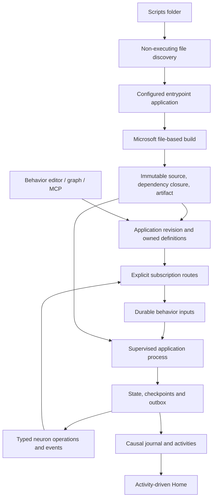

# File-based scripting and explicit neuron communication

Status: design assembled from accepted grilling decisions Q1–Q39; awaiting final whole-design confirmation. No runtime implementation is included in this document.

The C# below is complete authoring examples **against the proposed API**, not code that compiles against today's SDK. Only the file-based application mechanism and existing project reference were execution-tested. API names, port declarations, and lifecycle behavior below describe the refactor to implement.

## Architecture

DigitalBrain programs consist of ordinary single-file C# applications that declare typed objects, connections, and application work. Microsoft’s SDK compiles each application. DigitalBrain never generates or maintains a project or solution for a script.

The file-based application is both an authoring entrypoint and the executable representation of its durable handlers. Installing it retains an immutable source/dependency revision and executable artifact. A DigitalBrain worker supervises executions of that artifact; a lambda remains code in that process, reconstructed when the application restarts. The lambda and its captured objects are not serialized into Orleans.

Orleans holds application heads, behavior identities, subscription ownership, admitted inputs, state, checkpoints, output intents, leases, and completion records. Existing behavior queues, execution fencing, causal contexts, and revision snapshots are foundations to retain. This is not a replacement with ephemeral client callbacks.



There are four independent identities: application key, behavior key, revision ID, and execution/operation ID. Application and behavior keys are scoped by owner and principal. Behavior keys remain stable across file moves and code revisions; the registry records which application owns each behavior key and rejects competing ownership. Paths are provenance, not identity. A process ID or random connection ID must never become the stable behavior identity.

## Communication contracts

Public contracts expose operations, queries, emitted events, and deliberately connectable input ports. Public SDK contracts must not inherit Orleans worker/kernel interfaces. Internal implementation handlers are not made callable merely because they handle a type.

| Concept | Meaning |
|---|---|
| Command / invoke | Address one public operation on one object; obtain a tracked completion or failure. |
| Query | Address one object and obtain a typed result. |
| Publish | Emit an event from an authorized source output; acknowledge durable acceptance, not completion of recipients. |
| Subscribe / connect | Declare a source event → target input connection owned by a definition. |
| Handle | Bind a named input to local executable code; does not discover an audience or subscribe by itself. |
| Broadcast | Descriptive term for explicit, scoped event fan-out; no second public routing mechanism is needed initially. |

Use explicit typed ports. `EventPort<T>` identifies an output, `InputPort<T>` identifies a connectable input, `CommandPort<T>` identifies a callable operation, and `QueryPort<TRequest,TResult>` identifies a query. They are descriptors containing stable contract and instance identity, not executable delegates or unrestricted grain references.

An `EventPort<T>` is not a general permission to impersonate its source. Publishing is allowed only for the executing definition’s declared outputs or an explicitly authorized ingress. A connectable telemetry input can accept validated deliveries from a trusted activity source without becoming a public command that arbitrary clients can forge.

A direct connection requires matching supported wire contracts. `Connect` accepts either a connectable input or an explicitly public command port with that payload type; connecting an event to a command does not expose private handlers. The event-triggered command receives a stable operation ID derived from the event and target operation identity, under the declaring principal's authorization. A transformation uses a named behavior handler which invokes an operation or publishes its own event. Do not infer conversions or infer subscriptions from successful commands. Learned synapses remain observational causal edges and suggestions. They no longer participate in delivery.

Typed payload contracts use stable wire identifiers and schema versions, not `typeof(T).Name`. Shared SDK/module contracts are the first supported cross-script contracts. Installing a custom cross-script contract must register its stable identity, schema and supported codec before any route using it becomes ready; arbitrary CLR types are not assumed to exist on every silo. Invalid/unknown contracts fail validation before activation. Types used only in ordinary local calculations need no wire identity. Durable inputs, state, outputs and checkpointed results all need supported stable serialization/schema identity, even when their CLR types are declared in only one script.

Each subscription has an owner-definition identity and stable connection key. Multiple definitions may own the same physical route. Removing one declaration removes only that ownership. Delivery deduplicates by event ID + target instance + stable input ID; two different input IDs intentionally receive separate deliveries. The causal record includes the contributing subscription identities.

Authorization is checked when declaring a connection and when admitting a delivery or operation. Owner-global source IDs do not authorize cross-principal event access. Ordinary events retain the verified principal; root initialization is a narrowly authorized owner-lifecycle event with per-principal subscription checkpoints. An `Owner` comparison inside user code is defense in depth, not the authorization boundary.

## Definitions, application and invocation

1. **Discovery** lists candidate files without running them. Startup is configured with `scripts/start.cs`; other discovered files are not automatic entrypoints.
2. **Definition** runs a selected application in declaration mode to construct its manifest. This includes stable keys, dependency declarations, handlers, outputs, connections and schema declarations. It must be repeatable.
3. **Installation** validates the selected dependency closure, compiles it, persists immutable revisions, and stages registrations. It does not invoke arbitrary business handlers.
4. **Application** reconciles definitions and executes explicitly declared configuration callbacks in dependency order, using a durable operation record.
5. **Invocation** admits an input to an already installed behavior or invokes a neuron operation. It does not implicitly reapply its source file.
6. **Execution** reconstructs registered handlers from an installed artifact and processes admitted work under a worker lease.

`app.Script(key, relativePath)` declares a dependency without applying it. Paths resolve relative to the declaring source file. `context.ApplyScriptAsync(reference)` applies that already-snapshotted child revision. Reject cycles, conflicting identities, and undeclared dependencies. The initial version does not support arbitrary runtime-computed script paths inside durable work.

Validate/build the complete declared graph before changes to live definitions. Record the child reference-to-revision mapping in the root application operation. Effective revision equality includes source, dependency revisions, resolved contract/library artifacts and evaluated build settings. Thus unchanged `start.cs` with changed `ui.cs` produces a changed effective root revision and reruns its application callback. Within that operation a repeated child application joins the recorded child result. A crash cannot make `start.cs` and discovery independently execute a child. A later application compares revisions and skips already-successful unchanged work; a failed application can resume instead of being permanently suppressed by a failure ledger entry.

Configuration is not a distributed transaction. Record ordered steps, checkpoint successful effects and expose partial completion. A failed dependency prevents its dependents from applying, while unrelated active applications continue. External effects are not automatically undone. Deliberate reruns need an explicit new operation, and idempotent operations remain the preferred authoring pattern.

Declaration mode may connect to obtain the authenticated context, but SDK mutation APIs reject effects outside an application or execution scope. This does not sandbox arbitrary C# file/network access: authors must keep top-level code free of business effects. The programming model cannot make arbitrary top-level C# execution pure.

## Connection and process lifetime

Keep `DigitalBrainClient.ConnectAsync(args)`. It establishes configuration, verified identity, Orleans access and ownership/disposal; it never initializes the brain. Remove implicit initialization from ordinary message transport as well as connection setup.

`brain.Application(key)` returns a distinct definition/lifecycle object. `brain.Root.Id` replaces the ambiguous proposed `brain.Id`. Expose `brain.Owner` and `brain.Principal` separately. `brain.Get<TContract>(id)` returns a typed author-facing contract reference, not a kernel grain API.

The application entrypoint ends with `app.RunAsync(args)`. In ordinary terminal/startup mode it installs/applies and awaits tracked application completion, then returns. Under a worker it serves the pinned artifact under a verified execution context. Worker mode and acting principal cannot be enabled merely by an untrusted command-line flag; a valid server-issued lease/context is required.

The worker supervises processes by immutable application revision. Different revisions may coexist while old work drains. Each behavior instance runs one admitted input at a time by default; distinct behaviors may run concurrently. Mutable static variables and closure objects are not durable state and must not be relied on for correctness.

An owned client disposes its host. A borrowed execution view disposes only its local scope; it cannot shut down the parent host. Child application operations inherit authorization and causal context, not a requirement to share an operating-system process. Worker children establish their own scoped transport as required.

SIGINT/shutdown stops claiming new work, allows bounded graceful completion, and requests cancellation before releasing/fencing leases. A crash recovers accepted inputs. Cancelling an installer’s wait does not implicitly delete definitions or cancel already accepted application work; report its operation ID for status/resume. Temporary listeners are explicit session-bound APIs, removed on disposal or lease expiry, and do not survive client exit.

## Initialization and readiness

Do not conflate process startup, Orleans grain activation, behavior enablement, and logical brain initialization. Preserve initialization as once per owner brain lifetime. Revision replacement and worker restart are not new initialization events.

Application configuration in `start.cs` applies activities, then UI, then explicitly ensures initialization. Initialization-specific behaviors subscribe before that final step. This moves configuration out of the original activation callback so changed files can be applied without resetting initialization replay.

Readiness means contract validation, artifact availability, committed application revision, durable source bindings, compatible handlers and durable input admission are ready. It does not require every handler process to be warm. Pending compilation/validation must have a distinguishable status, not a successful readiness result.

Publish initialization through the durable event mechanism with a stable initialization ID and atomic initialization record/output intent. Do not retain the current publish-then-persist-boolean duplicate window. Bind and catch-up must coordinate using a cursor/checkpoint handshake so an event concurrent with registration is neither missed nor admitted twice.

Initialization catch-up uses subscription identity + initialization ID. Updating code does not clear that checkpoint. A late eligible subscription receives initialization once even if the owner was initialized earlier. While an application is being configured, its initialization deliveries are retained behind a configuration gate rather than executed immediately upon binding. `EnsureInitializedAsync` releases that application's gate after the preceding configuration steps; if no explicit ensure call is needed, successful completion of the application callback releases catch-up for an already initialized brain. A failed configuration does not release its staged initialization work. The runtime supplies the authorized principal scope for the delivery without rebroadcasting other principals' events.

Separate installation readiness from application completion. `RunAsync` awaits the application callback and the finite initialization work registered as part of that application, including catch-up already in progress. It does not await every live subscription, arbitrary future timer, or all work in the brain. Existing terminal initialization failure is reported, not treated as success; retry is an explicit tracked operation.

## Durability, ordering and revisions

Durable behavior processing is at least once. Input deduplication, stable operation IDs, bounded retries, durable outboxes, execution leases and fencing prevent many duplicate effects; they are not a promise of general exactly-once execution.

Persist per-target pending event delivery before acknowledging publication acceptance, including the recipient snapshot/route generation needed for recovery. No-recipient publication is a valid result and does not create future delivery unless the source has an explicit replay contract. Fan-out failures do not erase successful recipient progress. Publish acceptance, recipient admission and handler completion are different statuses.

Ordinary durable subscriptions start at their committed binding point. Retain pending work for existing durable subscriptions according to explicit retention limits; exhausted retries or limits produce visible failure records. Historical replay is opt-in and source-supported. The causal journal is not automatically an unlimited event store. Temporary listeners use live session delivery by default.

One behavior processes one input at a time in durable admission order; publishers have no global order. The durable claim gate belongs to the stable behavior identity and spans all artifact revisions/processes. On resume, paused old-revision inputs retain their place ahead of later admissions. When an input exhausts automatic retries, mark it failed and visible rather than blocking the queue forever. Explicit replay is a new tracked attempt preserving the original causal relationship. Operations requiring stronger application-specific ordering must encode that invariant rather than rely on an undocumented global queue.

Execution checkpoints commit behavior state updates, output intents and checkpoint progress together. A remote operation creates a durable boundary: assign a stable operation ID and record its result. Recovery replays local code up to recorded checkpoints, verifies effect sequence identity, and reuses recorded outcomes. At final completion commit remaining state/output intents and acknowledge the input. A changed effect sequence within the same pinned revision is a determinism violation and must fail visibly rather than attach an old result to a different command.

Replay uses the persisted input-start state view and recorded checkpoint overlays/read outcomes, not the latest committed state as though execution were new. Crossed checkpoints restore their recorded writes and results without committing those writes again. For example, increment-state → remote-call → crash must not increment state a second time when the call checkpoint is replayed. Optimistic state versions prevent replay or explicit later retries from overwriting intervening state changes. This state/checkpoint transaction mechanism is new implementation work beyond today's request checkpoints.

External operations and nontransactional target neurons require their own idempotency support. A timeout means outcome unknown, not rollback. Query results used in durable control flow are checkpointed. Cancellation is cooperative; it cannot undo committed effects. New nondeterministic values influencing recorded work must come from recorded context values or be persisted before use.

Application code revisions switch together for new admissions. Stage all candidate definitions first, use an application-level revision head/admission fence to prevent mixed active revisions, then resume admission against the committed head. Accepted work retains its code and dependency revision. Independent behavior pause/resume is allowed without selecting different source revisions from one file.

Disable stops new admission, pauses queued work and lets running work finish; drain and cancel are separate operations. This deliberately changes current disable semantics, which cancel/fence pending work and outputs. Paused inputs retain their pinned revisions. Deletion must resolve retained/queued work explicitly before removing runtime state. Artifacts cannot be garbage-collected while referenced by active, queued, paused, failed-retained or replayable work.

State is scoped to stable behavior identity, with declared schema version and optimistic concurrency. Compatible upgrades retain state. An incompatible migration pauses admission, drains accepted work, migrates state and activates the new application revision. Failed draining or migration leaves a visible blocked upgrade; it does not drop old inputs.

## Source and editor ownership

The complete C# file is the source/revision unit. The behavior editor selects behaviors for inspection but edits and validates the full owning application. Activating a source revision is distinct from enabling/disabling an individual behavior.

Keep drafts, active revision, last applied file revision and file provenance separate. A repeated unchanged file does not overwrite an active UI edit. A diverged file/UI change creates a conflict and retains the last active revision. Reconciliation uses optimistic expected-revision checks.

Renaming a file while retaining application/behavior keys updates provenance. A missing file marks missing provenance; it does not implicitly delete a durable application. Explicit deactivation/deletion reconciles only subscriptions that definition owns. Graph and MCP edits create or update named wiring definitions and follow the same revision rules.

## Complete proposed authoring examples

These files belong in repository-root `scripts/`. All APIs involving application definitions, ports and contexts below are proposed. Existing payload types and Home structure are retained where possible. Explicit AI/UI project references are necessary because the current SDK project does not reference those module contracts.

### scripts/start.cs

```csharp
#:project ../src/Kernel/DigitalBrain.Sdk/DigitalBrain.Sdk.csproj
#:property TargetFramework=net11.0
#:property PublishAot=false

using DigitalBrain.Abstractions;
using DigitalBrain.Abstractions.Signals;
using DigitalBrain.Abstractions.Scripting;

await using var brain = await DigitalBrainClient.ConnectAsync(args);
var app = brain.Application("startup");

// Declarations only: neither child executes here.
var activities = app.Script("activities", "activities.cs");
var ui = app.Script("ui", "ui.cs");

var start = app.Behavior("start");
var initialized = start.State<bool>("initialized", schemaVersion: 1);

var onActivated = start.Handle<DigitalBrainActivated>(
    "on-activated",
    (activated, context, cancellationToken) =>
    {
        cancellationToken.ThrowIfCancellationRequested();
        if (activated.Owner != context.Brain.Owner)
            return Task.CompletedTask;

        // Buffered durable state: commits with this input's completion.
        context.State.Set(initialized, true);
        return Task.CompletedTask;
    });

app.Connect(
    "start-on-initialization",
    brain.Root.Events.Activated,
    onActivated,
    replay: ReplayPolicy.Initialization);

app.OnApply(async (context, cancellationToken) =>
{
    await context.ApplyScriptAsync(activities, cancellationToken);
    await context.ApplyScriptAsync(ui, cancellationToken);
    await context.EnsureInitializedAsync(cancellationToken);
});

// Terminal: apply, await tracked application completion, then exit.
// Worker: reconstruct registrations and serve the pinned revision.
await app.RunAsync(args);
```

The initialization handler demonstrates a durable behavior without making configuration depend on replay. Its initialized state is per behavior principal, even though logical brain initialization is owner-scoped. Reapplying UI changes does not rerun this handler.

### scripts/activities.cs

```csharp
#:project ../src/Kernel/DigitalBrain.Sdk/DigitalBrain.Sdk.csproj
#:project ../src/Modules/AI/Contracts/DigitalBrain.Modules.AI.Contracts.csproj
#:project ../src/Modules/UI/DigitalBrain.Modules.UI.Contracts/DigitalBrain.Modules.UI.Contracts.csproj
#:property TargetFramework=net11.0
#:property PublishAot=false

using DigitalBrain.Abstractions;
using DigitalBrain.Abstractions.Neurons;
using DigitalBrain.Abstractions.Scripting;
using DigitalBrain.AI;
using DigitalBrain.UI;

await using var brain = await DigitalBrainClient.ConnectAsync(args);
var app = brain.Application("activities");

var execution = brain.Get<IActivitySource>(IActivitySource.DefaultInstanceName);
var activities = brain.Get<IActivities>(IActivities.DefaultInstanceName);
var inbox = brain.Get<IComposer>(IComposer.DefaultInstanceName);
var assistant = brain.Get<IAssistant>("assistant");

app.Connect(
    "execution-to-activities",
    execution.Events.ExecutionChanged,
    activities.Inputs.ExecutionChanged);

app.Connect(
    "inbox-to-assistant",
    inbox.Events.UserMessaged,
    assistant.Inputs.UserMessaged);

await app.RunAsync(args);
```

The activities ingestion input is connectable under runtime source/principal policy. It does not grant permission to fabricate execution telemetry through a public command. The application owns both connections even though it declares no executable behavior.

### scripts/ui.cs

```csharp
#:project ../src/Kernel/DigitalBrain.Sdk/DigitalBrain.Sdk.csproj
#:project ../src/Modules/UI/DigitalBrain.Modules.UI.Contracts/DigitalBrain.Modules.UI.Contracts.csproj
#:property TargetFramework=net11.0
#:property PublishAot=false

using System.Collections.Generic;
using DigitalBrain.Abstractions;
using DigitalBrain.Abstractions.Neurons;
using DigitalBrain.Abstractions.Scripting;
using DigitalBrain.UI;

await using var brain = await DigitalBrainClient.ConnectAsync(args);
var app = brain.Application("ui");

var activities = brain.Get<IActivities>(IActivities.DefaultInstanceName);
var renderer = brain.Get<IUIRenderer>(ISurface.DefaultInstanceName);

app.Connect(
    "activities-to-home",
    activities.Events.Changed,
    renderer.Inputs.ActivityChanged);

app.OnApply(async (context, cancellationToken) =>
{
    var home = new SurfaceComponent(
        "split",
        Properties: new Dictionary<string, string>
        {
            ["graphFraction"] = "0.61",
        },
        Children:
        [
            new SurfaceComponent(
                "brain-graph", "brain",
                new Dictionary<string, string>
                {
                    ["scope"] = "selected",
                    ["activitiesName"] = IActivities.DefaultInstanceName,
                },
                [
                    new SurfaceComponent(
                        "activity-list", "activities",
                        new Dictionary<string, string>
                        {
                            ["placement"] = "top-right",
                            ["source"] = IActivities.DefaultInstanceName,
                        }),
                ]),
            new SurfaceComponent(
                "chat", "input",
                new Dictionary<string, string>
                {
                    ["name"] = "main",
                    ["voice"] = "true",
                }),
        ]);

    // Connection readiness precedes application callbacks.
    // This ID is stable across recovery of this application operation.
    await context.InvokeAsync(
        renderer.Commands.OpenSurface,
        new OpenSurface(
            context.CommandId("open-home"), "home", "One brain", home),
        cancellationToken);
});

await app.RunAsync(args);
```

Launch remains:

```shell
dotnet run --file scripts/start.cs -- [connection arguments]
```

`activities.cs` and `ui.cs` can also be applied directly. Shared stable application keys/revisions ensure direct application does not create a second durable identity. `start.cs` is the configured startup entrypoint; catalog discovery never separately runs its children.

## Minimal public API contract

This is the required authoring surface, not a complete declaration of runtime-internal interfaces. Port/member names in the examples are the proposed facade names; they do not expose existing internal grain interfaces wholesale.

| Surface | Members and semantics |
|---|---|
| Client | `ConnectAsync(args, cancellationToken)` → disposable `IDigitalBrain`; `Owner`, `Principal`, `Root`, `Get<TContract>(id)`, `Application(key)`. |
| Public root | `Id`; `Events.Activated : EventPort<DigitalBrainActivated>`. |
| Application | `Script(key,path) : ScriptReference`; `Behavior(key) : BehaviorDefinition`; `Connect<T>(key, EventPort<T>, InputPort<T>, replay)` and a public `CommandPort<T>` target overload; `OnApply(Func<ApplicationContext,CancellationToken,Task>)`; `RunAsync(args,cancellationToken)`. |
| Behavior definition | `Handle<T>(inputKey, Func<T,BehaviorContext,CancellationToken,Task>) : InputPort<T>`; `Command<T>(operationKey, handler) : CommandPort<T>`; `Query<TRequest,TResult>(queryKey, readOnlyHandler) : QueryPort<TRequest,TResult>`; `Event<T>(outputKey) : EventPort<T>`; `State<T>(key,schemaVersion) : StateKey<T>`. Command handlers use the same durable execution context as inputs; queries cannot mutate state or emit effects. |
| Application context | `Brain`; `ApplyScriptAsync(ScriptReference,ct)`; `EnsureInitializedAsync(ct)`; `CommandId(stepKey)`; checkpointed `InvokeAsync`, `QueryAsync`. |
| Behavior context | Authenticated execution `Brain`, behavior ID, input/event ID, causation, correlation, revision and cancellation; typed `State.Get/Set`; checkpointed `InvokeAsync`, `QueryAsync`, `PublishAsync`. |
| Commands | `InvokeAsync<T>(CommandPort<T>, T, ct)` awaits tracked operation completion; nonblocking submission/status is a separate client operation. Result receipt includes operation ID. |
| Queries | `QueryAsync<TRequest,TResult>(QueryPort<TRequest,TResult>, request, ct)` returns a typed result; execution context checkpoints it. |
| Events | `PublishAsync<T>(EventPort<T>, T, ct)` returns durable publication receipt; only authorized source owners can publish. |
| Temporary listener | Client `ListenAsync<T>(EventPort<T>, callback,ct)` returns an async-disposable session listener; no implied durable installation. |
| Administrative control | Apply/status/resume application operation; activate application revision; pause/resume/drain/cancel behavior; explicit replay; delete after retained-work resolution. These are distinct from neuron business ports. |

Required facade members for the examples are: `IActivitySource.Events.ExecutionChanged`, `IActivities.Inputs.ExecutionChanged`, `IActivities.Events.Changed`, `IComposer.Events.UserMessaged`, `IAssistant.Inputs.UserMessaged`, `IUIRenderer.Inputs.ActivityChanged`, and `IUIRenderer.Commands.OpenSurface`. These refer to existing payload types, with explicit published contract metadata and authorization rules.

Calls made through `context.Brain` during execution must remain execution-bound. They cannot bypass checkpointing, identity or causal attribution. Operations outside execution use a fresh authenticated client operation context and never implicitly initialize the brain.

Do not add both generic `Send`, `Publish`, `Broadcast` aliases with inconsistent semantics. Typed command/query/event ports make the intended interaction visible at the call site. A convenience direct method can be added only if it preserves those semantics.

## Neuron and flow migration inventory

All production families identified in the repository must be reviewed, including inherited contracts and partial implementations. This table records the starting disposition, not a claim that the new facades already exist.

| Family | Author-facing surface / migration |
|---|---|
| Brain | Explicit initialization and authorized initialization event; journal/root transport APIs remain infrastructure. |
| Behavior | Named inputs/outputs and management view; separate user code ports from save/claim/registry/worker APIs. |
| Behaviors registry | Administrative definition catalog; no business event surface inferred. |
| Activity source | Trusted ingestion; explicit execution-change output; retain durable early-event buffering. |
| Activities | Read query, connectable trusted ingestion and activity-change event; preserve principal-filtered projection. |
| X account | Publish-post command → new-post event; reference example for explicit command/event semantics. |
| Webhook | Read status and authenticated ingress; declared typed events; retain durable fan-out snapshot, retries and fencing. |
| GitHub repository | PR/evidence/check/status queries; explicit PR/access-change events; retain authorization and deferred completion semantics. |
| Agent | Request/reply contract; do not turn every reply into a subscribable event. |
| Assistant | Public request and connectable inbox input; separate internal turn-worker APIs; explicitly type supported emitted facts. |
| Gmail, Salesforce, Aspire agent wrappers | Review inherited generic request/reply surface; preserve wrappers without inventing domain events. |
| Execution | Start/status operations and explicit lifecycle event; currently lifecycle is journal-only. |
| Timer | Start/cancel/status operations and explicit elapsed event; currently elapsed is journal-only; preserve generation/recovery semantics. |
| Vector memory | Store/search/remove typed operations; events only when required, not inferred from replies. |
| Composer / user messages | Authorized ingress and typed user-message output; preserve actor context on owner-global source. |
| Chat | Separate public send/cancel/read/focus/user-action operations from private turn/note/card handlers; explicitly decide supported lifecycle outputs. |
| UI renderer | Open-surface operation, connectable activity input and deliberately supported interaction outputs. Existing `ControlActivated` handling is a no-op and must not be advertised as working behavior. |
| Turn/execution workers, kernel interfaces | Internal infrastructure; exclude from author catalog. |
| Surface/chart/transcript/image/memory/workspace-index/execution-context entities | Keep typed state APIs; do not fabricate neuron events by inheritance. |

Preserve these concrete routes and outcomes:

- Activity source execution changes → activities → renderer → activity-driven Home. Keep telemetry on separate durable turns to avoid recursive activity and renderer callback deadlocks.
- Composer user messages → assistant. Assistant input acceptance is not completion of the asynchronous assistant turn.
- Saved behavior notes → selected chat, with explicit supported input and definition ownership.
- Repository/webhook facts → subscribed behaviors using durable recipient recovery.
- Behavior/editor save → validate → activate → input admission → pinned artifact execution → checkpointed outputs → activities/causal graph.

Causal envelopes retain owner, verified principal, source and target, correlation, causation, event/operation IDs, application/behavior revision and contributing connections. Handler side effects are attributed to the behavior, not the installer or root brain. Telemetry must continue excluding its own bookkeeping to avoid recursion.

## Migration sequence

1. Lock intended flows with client-driven integration scenarios. Inventory all public candidates, internal handlers, outputs, learned-edge dependencies, and owner/principal policies. Preserve a snapshot of current persisted subscription provenance before transforming it.
2. Introduce explicit contract/port metadata and SDK facades alongside current implementation interfaces. Add missing intended lifecycle events. Keep aliases/wire identifiers stable where valid; explicitly migrate simple-name collisions.
3. Introduce definition-owned connections and event-target admission deduplication. Existing explicitly bound routes need recorded migration ownership; learned routes remain observation-only and are never blindly promoted. Update graph/MCP writes to definitions before removing bypass paths.
4. Introduce application revisions, artifact storage, dependency snapshots and durable application operations. Reuse behavior queues/request-checkpoints/leases; implement the new state-plus-outbox checkpoint transaction and replay-state view, and add application-level activation coordination. Wrap each existing saved script as a one-behavior application during migration.
5. Implement file-based build and worker execution. No per-script project generation, no IAW orchestration project generator, no Roslyn `#load` authoring requirement. Keep legacy execution only for existing revisions until their pinned work is resolved.
6. Split connection from initialization in both connection and transport. Implement initialization event/checkpoint recovery and readiness barriers. Replace local startup JSONL deduplication with durable application operations.
7. Move the three startup files to root `scripts/` with the proposed phases. Replace the old activation worker startup entrypoint so only one startup authority remains. Verify Home and assistant behavior before retiring the old path.
8. Update full-file editor semantics, drafts/conflicts/provenance, pause versus cancel controls, and graph/MCP ownership. Migrate existing disable semantics explicitly; do not silently relabel cancellation as pause.
9. Add light testing facade, restart/retry and isolation coverage, then retire ambiguous publish aliases and learned routing. Retain old revision artifacts until no retained work references them.

Migration is gated by end-to-end behavior, not completion of isolated renames. Do not mix learned and declared delivery in the new mode. Keep legacy compatibility explicitly scoped to unmigrated execution where unavoidable, with no duplicate routing path for the same application.

## Lightweight testing and verification

Build on `DigitalBrain.Testing/BrainSimulation`, which already uses production Orleans composition and real client access. Introduce a small fixture for fresh owner/principal contexts, script application, outcome assertions, diagnostic capture and worker restart. Do not introduce a second fake pub/sub implementation.

Illustrative test shape against the proposed fixture:

```csharp
await using var test = await BrainTest.StartAsync(cancellationToken);
await test.ApplyScriptAsync("scripts/start.cs", cancellationToken);
await test.ExpectSurfaceAsync("desk", "home", cancellationToken);
await test.ExpectBehaviorStateAsync("start", "initialized", true, cancellationToken);

await test.RestartWorkersAsync(cancellationToken);
await test.ApplyScriptAsync("scripts/start.cs", cancellationToken);
await test.ExpectConnectionCountAsync("ui", "activities-to-home", 1, cancellationToken);
```

The helper assertions must read real persisted/projection state under a deadline and include causal diagnostics on failure. This example is a proposed fixture contract, not a test run. Worker restart and durable silo/storage restart are separate tests; the current volatile simulation alone cannot demonstrate recovery after storage loss.

Required verification matrix:

| Area | Required evidence |
|---|---|
| File-based apps | Build/run all three final examples with repo settings; no app-maintained project/solution; explicit `--file`; SDK cache concurrency; installed artifact restart without mutable source. |
| Distribution | Actual package/feed availability, exact version restore outside repository, relevant build-policy equivalence; do not infer publication from package metadata. |
| Contracts | Private handlers cannot be called; incompatible/unknown event types rejected; source impersonation rejected; missing lifecycle events emitted once per underlying logical transition with delivery deduplication. |
| Routing | Directed command creates causal observation but no later subscription; repeated declaration does not duplicate delivery; two owners of one route survive one owner's removal; two distinct inputs both receive. |
| Startup | Empty brain; initialized brain; late subscriber; concurrent subscription/initialization; initialization crash window; unchanged reapply; child applied directly and from root; failures retry without duplicate setup. |
| Application | Whole graph validates before mutation; cycles rejected; partial failure resumes; installer exits while durable handlers remain usable; cancelled wait retains operation status. |
| Durability | Kill worker before/after checkpoint and acknowledgment; increment-state/call/crash does not increment twice; recover outputs/results; retries exhaust visibly; timeout is not false failure; execution leases fence stale workers across revisions. |
| Revisions/state | Old inputs finish on old artifact; new inputs use committed application head; UI conflict preserved; rename retains identity; deletion resolves retained work; incompatible migration waits for drain. |
| Disable | New admissions stop, queued inputs pause, running work finishes; explicit cancellation remains available and separately tested. |
| Isolation | Distinct owners and principals; owner-global sources; forged IDs/ports; unauthorized subscription/invoke/publish; child context and tests cannot leak scope. |
| Product flows | Home graph/activity list/chat/voice structure; activity progression; inbox-to-assistant; behavior edit/apply; causal source/revision/connection attribution. |

Use `digitalbrain-mcp` to inspect definitions, revisions, owned connections, operation status and causal deliveries, and to exercise supported invocation paths after implementation. Verify its graph edits produce revisions rather than bypass ownership. No callable DigitalBrain MCP tool was found in the active tool inventory during this design session; connecting that surface is a verification prerequisite, not a passed check.

Use computer/browser interaction against the running product after implementation: open Home, trigger a real interaction, inspect activity progression and graph, edit a behavior draft, activate its application revision, test conflict presentation, and exercise pause/resume. Browser automation is available; this design session has not performed that product verification. Discover the running app through its actual hosting state before opening it.

Tests, MCP observations and computer-use evidence must agree on the same application revision and principal. Report exact commands, outcomes and remaining gaps at implementation handoff. Do not label these proposed examples compiled or the refactor verified before implementing them.

## Verified facts and references

- Installed SDK probe succeeded with `11.0.100-preview.7.26381.103`; `global.json` requests preview.6 with `latestFeature`. A disposable file using the original SDK project directive, `net11.0` and `PublishAot=false` ran with arguments and produced `sdk-fileapp-ok:alpha|beta`. It connected to no brain. Scratch was removed.
- Repository `Directory.Build.props`, `Directory.Build.targets` and central package settings were inherited. SDK intermediates were under the system temporary `dotnet/runfile` directory. This validates the mechanism, not the future API or full module reference closure.
- Development uses existing project references. Distribution uses the documented `#:package PackageId@Version` form only after the real identity/version/feed is established. Repository `0.1.0-alpha.1` metadata is not proof of a published package.

Primary external references:

- [Microsoft file-based programs tutorial](https://learn.microsoft.com/en-us/dotnet/csharp/fundamentals/tutorials/file-based-programs).
- [Microsoft file-based apps reference](https://learn.microsoft.com/en-us/dotnet/core/sdk/file-based-apps).
- [Previous DigitalBrain client on master](https://github.com/intochat/digitalbrain/tree/master/src/Kernel/DigitalBrain.Client), inspected via the local `master` ref. The old typed wrapper is useful precedent; it also had implicit activation and is not a durable-lambda implementation.

Local evidence anchors (repository-relative paths):

- `src/Kernel/DigitalBrain.Sdk/Client/DigitalBrainClient.Connection.cs:21,50`: borrowed execution access and eager initialization.
- `src/Kernel/DigitalBrain.Sdk/Client/DigitalBrainClientTransport.cs:226`: implicit initialization in message transport.
- `src/Kernel/DigitalBrain/Neuron/BrainNeuron.cs:26`: root initialization journal/broadcast/persistence sequence.
- `src/Kernel/DigitalBrain/Neuron/Neuron.cs:435`: ordinary subscription acknowledgment already awaits durable binding. Earlier broad concern that all subscription changes return before binding was corrected by this inspection.
- `src/Kernel/DigitalBrain/Neuron/BehaviorNeuron.cs:211`: valid enable waits for binding; pending validation can precede readiness. `:221` current disable fences/cancels. `:492` pins admitted program revisions.
- `src/Kernel/DigitalBrain/Neuron/SignalSender.cs:83` and `SignalRouter.cs:28`: learned routes affect later broadcasts today.
- `src/Kernel/DigitalBrain.Contracts/NeuronReferenceExtensions.cs:44` versus `src/Kernel/DigitalBrain.Sdk/Client/DigitalBrainClientTransport.Execution.cs:40`: current inconsistent publish semantics.
- `src/Kernel/DigitalBrain.Scripting/Startup/StartupScriptOptions.cs`, `StartupScriptWorker.cs`, `StartupScript.cs`, `CSharpStartupScriptRunner.cs`: single configured entrypoint, activation replay, local ledger, source bundling and Roslyn execution.
- `src/Kernel/DigitalBrain.Scripting/scripts/{start,activities,ui}.cs`: original startup flows and Home structure.
- `src/Kernel/DigitalBrain.Silo/MapBehaviorStudio.cs`, `BrainGraphSource.cs`, `src/Kernel/DigitalBrain.Mcp/GraphTools.cs`: editor lifecycle and direct graph subscription writes.
- `src/Testing/DigitalBrain.Testing/BrainSimulation.cs` and `tests/DigitalBrain.Simulation.Tests/Features/BehaviorSteps.cs`: existing real-client simulation foundation.

IAW references inspected:

- `D:/Projects/IAW/src/Aspire.Client/IAWCluster.cs`: concise owned client connection/disposal inspiration. Its random execution identity is not a stable behavior key.
- `D:/Projects/IAW/src/Core/Agents/Agent.Streams.cs`: typed server-side stream consumers; not serialization of arbitrary client lambdas and not a complete subscription reconciliation mechanism.
- `D:/Projects/IAW/src/Agents/Orchestration/CodeOrchestratorAgent.cs`: per-orchestration project generation and `dotnet run --project` are explicitly excluded.

## Confirmation boundary

This document consolidates the accepted architecture and supplies the requested examples, public API, migration sequence and verification criteria. Final review should confirm that these concrete examples express the intended programming model. Implementation, runtime tests of the new API, MCP verification and computer-use verification begin only after that confirmation. No application code has been changed by this design document.
